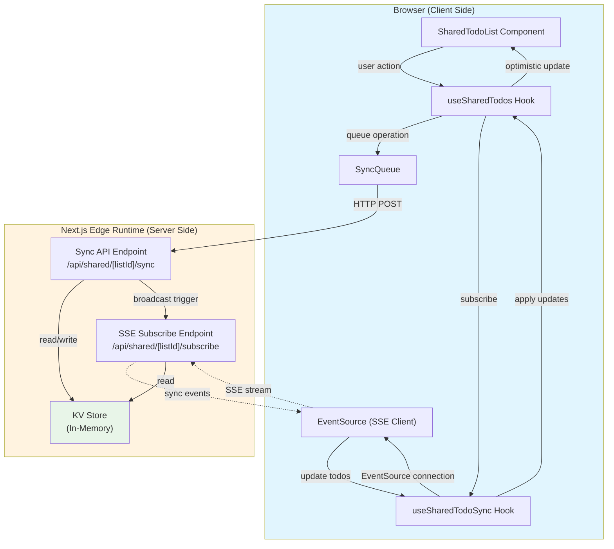
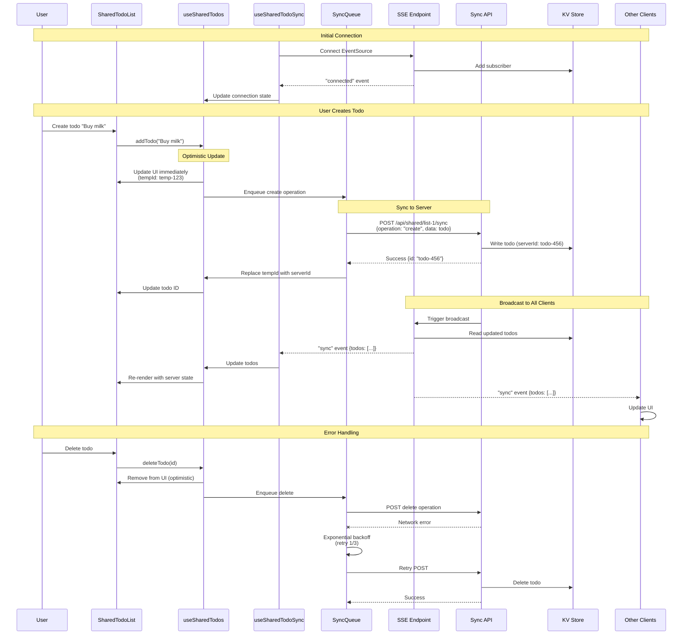
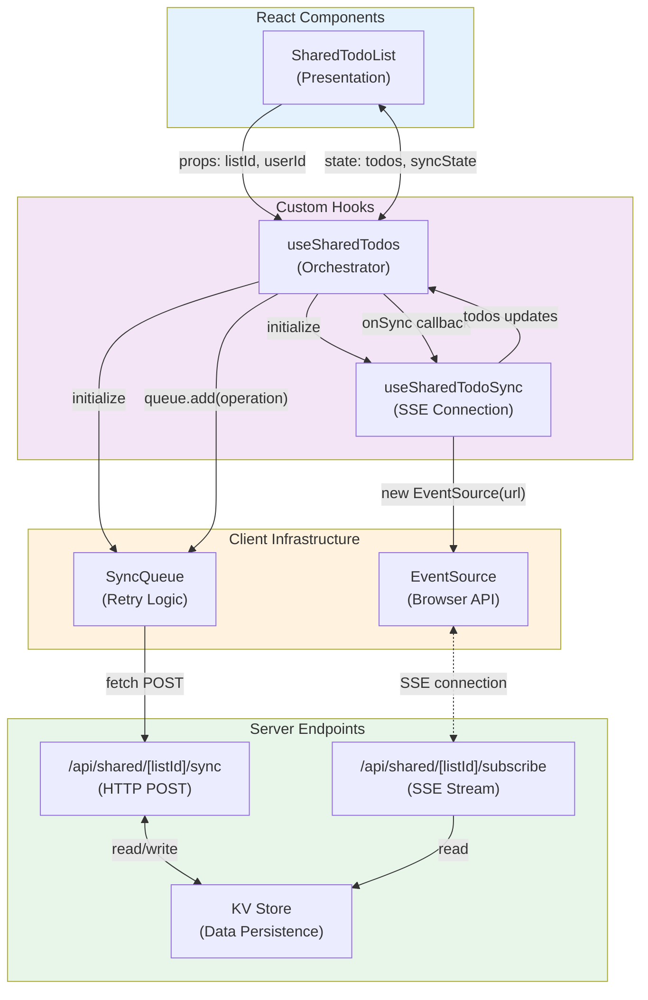
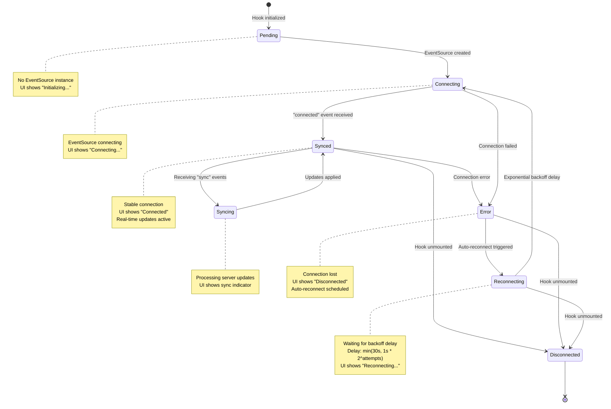

# Real-Time Synchronization Architecture

This document provides comprehensive architectural diagrams for the real-time synchronization feature introduced in
[GitHub Issue #122](https://github.com/mikiwiik/instructions-only-claude-coding/issues/122). For decision rationale
and alternatives, see
[ADR-022: Real-Time Synchronization Architecture](../adr/022-realtime-sync-architecture.md).

## System Architecture Overview

This diagram shows the high-level client-server architecture for real-time synchronization using Server-Sent Events
(SSE).

## Sync Lifecycle Sequence Diagram

This diagram illustrates a complete synchronization lifecycle from user action to propagation across all clients.

## Component Interaction Diagram

This diagram shows how React components, hooks, and server infrastructure interact to provide real-time
synchronization.

## Connection State Diagram

This diagram illustrates the connection lifecycle and state transitions for the SSE-based real-time sync.

## Key Design Decisions

### 1. Server-Sent Events (SSE) over WebSockets

- **Unidirectional**: Server-to-client updates only
- **Simpler**: Built-in browser support, automatic reconnection
- **Scalable**: HTTP-based, works with standard infrastructure
- **Sufficient**: Updates flow server → client; client → server uses HTTP POST

### 2. Optimistic Updates with Rollback

- **Immediate Feedback**: UI updates instantly on user action
- **Temporary IDs**: Client generates temp IDs, replaced by server IDs
- **Rollback on Error**: Failed operations revert UI state
- **Better UX**: Feels instant even with network latency

### 3. Sync Queue with Retry Logic

- **Reliability**: Operations queued and retried on failure
- **Exponential Backoff**: 1s, 2s, 4s delays prevent server overload
- **Max Retries**: 3 attempts before marking operation as failed
- **Ordered Processing**: FIFO queue ensures operation order

### 4. Last-Write-Wins Conflict Resolution

- **Simple**: Server timestamp determines winner
- **Predictable**: Clear, understandable behavior
- **Stateless**: No complex merge logic or operational transforms
- **Trade-off**: Potential data loss in rare concurrent edit scenarios

See [ADR-023: Conflict Resolution Strategy](../adr/023-conflict-resolution.md) for detailed rationale.

## Data Flow Summary

### Create Todo Flow

1. User types todo text → clicks "Add"
2. `useSharedTodos` generates temporary ID → updates UI
3. `SyncQueue` enqueues create operation
4. `SyncQueue` POSTs to `/api/shared/[listId]/sync`
5. Server writes to KV store with real ID
6. Server returns real ID to client
7. Client replaces temp ID with real ID
8. SSE endpoint broadcasts to all clients
9. All clients receive sync event → update UI

### Update Todo Flow

1. User edits todo text or toggles completion
2. `useSharedTodos` updates UI optimistically
3. `SyncQueue` enqueues update operation
4. POST to sync endpoint → server updates KV
5. Broadcast to all clients via SSE
6. Clients apply server state

### Connection Recovery Flow

1. Network interruption → EventSource error
2. `useSharedTodoSync` detects error
3. Close existing EventSource
4. Schedule reconnect with exponential backoff
5. Attempt 1: Wait 1s → try to connect
6. Attempt 2: Wait 2s → try to connect
7. Attempt 3: Wait 4s → try to connect
8. Success → resume normal operation
9. Failure → continue backoff up to 30s max

## Performance Considerations

### Client-Side

- **EventSource**: Native browser API, efficient SSE handling
- **Debouncing**: Queue batches rapid operations
- **Memory**: Single EventSource per list, cleaned up on unmount

### Server-Side

- **Edge Runtime**: Low latency, global distribution
- **Polling**: 2s interval for development (production should use Redis Pub/Sub)
- **Heartbeat**: 30s ping to keep connections alive

### Network

- **SSE Overhead**: ~100 bytes per event
- **HTTP/2**: Connection multiplexing reduces overhead
- **Compression**: gzip/brotli for event payload

## Testing Strategy

### Unit Tests

- `useSharedTodoSync`: Connection management, event handling
- `useSharedTodos`: Optimistic updates, state management
- `SyncQueue`: Retry logic, exponential backoff

### Integration Tests

- Multi-client sync scenarios
- Connection resilience (disconnect/reconnect)
- Race conditions and conflict resolution

### Manual Testing

- Open multiple browser tabs
- Create/update/delete todos in one tab
- Verify instant updates in other tabs
- Test offline behavior and recovery

## Future Enhancements

### Short-term

- **Redis Pub/Sub**: Replace polling with real Pub/Sub
- **User Authentication**: Secure SSE connections with auth tokens
- **Presence Indicators**: Show active users in shared list

### Long-term

- **Operational Transforms**: More sophisticated conflict resolution
- **Collaborative Cursors**: Show where others are editing
- **Undo/Redo**: Sync-aware undo stack
- **Offline-First**: Service Worker for full offline support

## References

- [ADR-022: Real-Time Synchronization Architecture](../adr/022-realtime-sync-architecture.md)
- [ADR-023: Conflict Resolution Strategy](../adr/023-conflict-resolution.md)
- [Server-Sent Events Specification](https://html.spec.whatwg.org/multipage/server-sent-events.html)
- [MDN: Server-Sent Events](https://developer.mozilla.org/en-US/docs/Web/API/Server-sent_events)
- [GitHub Issue #122](https://github.com/mikiwiik/instructions-only-claude-coding/issues/122)

---

This architecture diagram complements the ADRs and provides a visual reference for understanding and implementing
real-time synchronization in the todo application.
