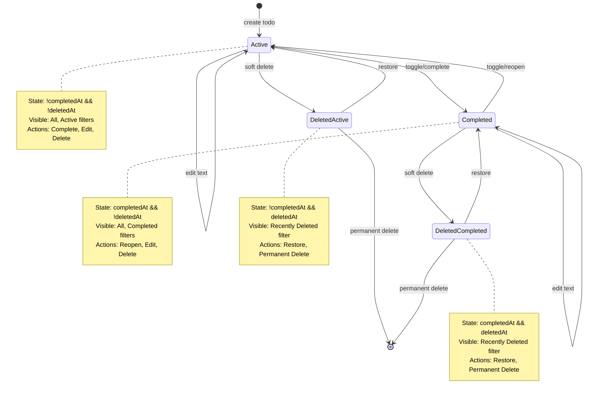
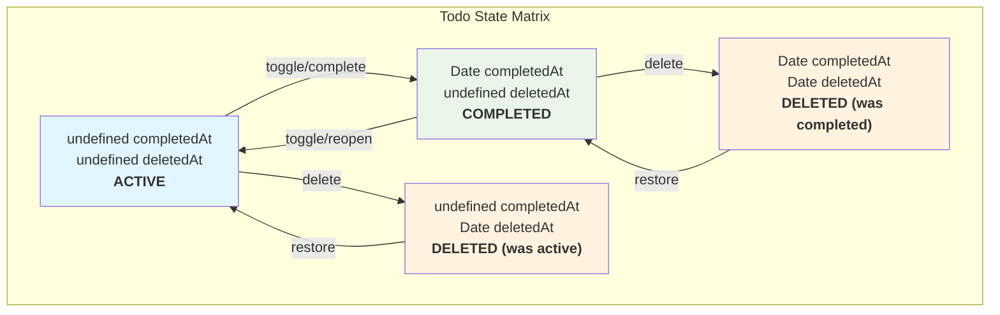
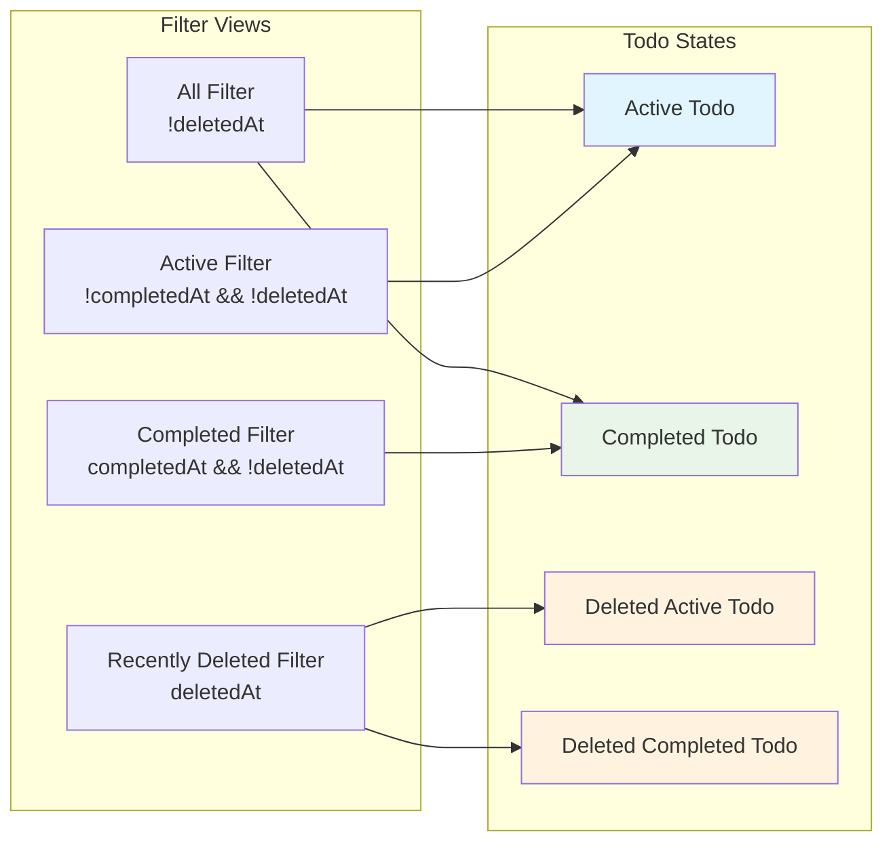

# Todo States Diagram

This diagram visualizes the todo state model and transitions described in
[todo-states.md](todo-states.md).

## State Transition Diagram

## State Matrix Visualization

## Filter Views

## Key Design Principles

1. **Deletion Precedence**: `deletedAt` always takes precedence over
   `completedAt` for filtering
2. **Soft Delete**: Deletion preserves completion state for restoration
3. **Timestamp-Based**: States determined by presence/absence of timestamp
   fields
4. **Simple Boolean Logic**: Easy to reason about and implement

## Usage

This diagram complements the detailed state documentation in
[todo-states.md](todo-states.md) and provides a visual reference for:

- Understanding state transitions
- Implementing filter logic
- Debugging state-related issues
- Communicating state model to stakeholders
