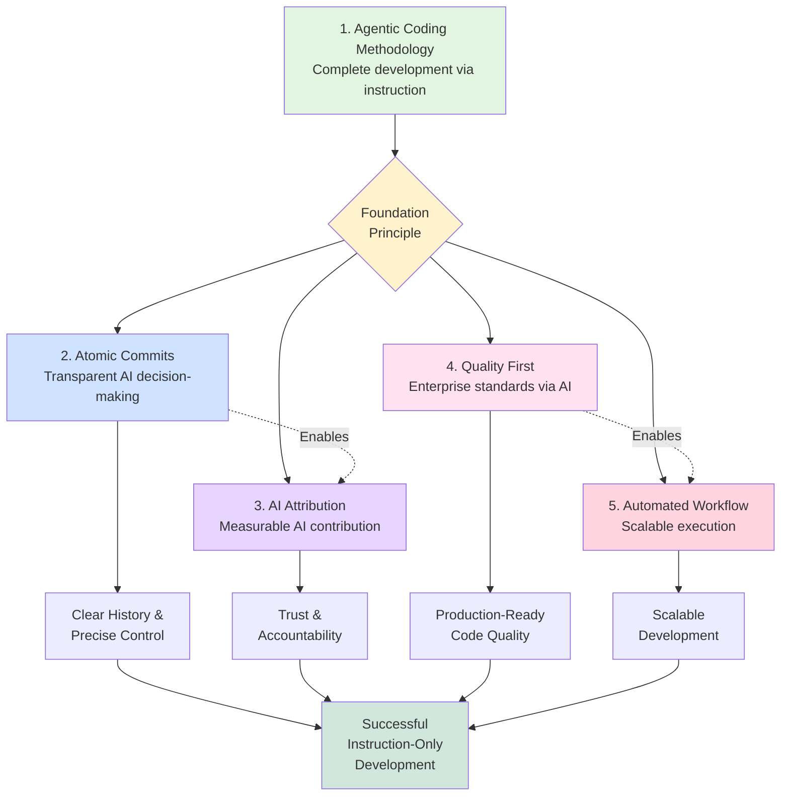
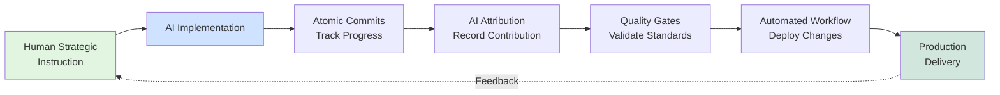

# Development Principles

## Purpose

This document explains the strategic principles guiding all development in the Todo App project. These principles define
WHY we work the way we do and HOW they support the instruction-only development methodology.

## Relationship to Other Documentation

- **This Document (principles.md)**: WHY - Philosophy and strategic importance
- **[framework.md](framework.md)**: WHAT - Methodology, roles, and agent coordination
- **[workflows.md](workflows.md)**: HOW - Git workflow, commit strategy, PR protocol
- **[../development/workflow.md](../development/workflow.md)**: HOW - Code quality, testing, daily practices
- **[../adr/](../adr/)**: DECISIONS - Specific technical choices with rationale

## The Five Core Principles

### 1. Agentic Coding Methodology (The Foundation)

**Philosophy**: Complete software development through strategic instruction rather than manual coding

**Why This Matters**:

In traditional development, humans write code directly. This project demonstrates a paradigm shift where:

- **AI handles complete implementation** via natural language instruction
- **Humans focus on strategy** (what and why) while AI handles tactics (how and when)
- **Professional standards are maintained** entirely through AI execution
- **100% AI-generated codebase** proves instruction-only development viability

This is not "AI assistance" - it's **complete lifecycle development via instruction**, from planning through production
deployment.

**Core Components** (from [framework.md](framework.md)):

1. **Pure Instruction Implementation**: All development occurs through natural language rather than manual coding
2. **Strategic vs. Tactical Separation**: Human provides requirements, AI handles all technical execution
3. **Professional Standards Maintenance**: Enterprise-quality practices (TDD, CI/CD, documentation) maintained by AI
4. **Complete Lifecycle Coverage**: From initial planning to production deployment via instruction-only workflow
5. **Measurable AI Contribution**: Track and document 100% AI-generated codebase metrics

**Role Boundaries**: See [README.md Role Definition](../../README.md#-role-definition-and-boundaries) for the
authoritative breakdown of human vs. AI responsibilities.

**Documentation**:

- **Role Definition**: [../../README.md](../../README.md#-role-definition-and-boundaries) - Authoritative role boundaries
- **Strategic**: [framework.md](framework.md) - Complete methodology and agent coordination
- **Operational**: [../development/workflow.md](../development/workflow.md) - Daily development practices
- **Visual**: [../diagrams/development-workflow.md](../diagrams/development-workflow.md) - Process visualization

**Related Principles**: This is the WHY for all other principles. Without instruction-only development:

- Atomic commits would just be good practice (not critical for AI traceability)
- AI attribution would be unnecessary (no AI work to attribute)
- Quality gates would be standard practice (not proof of AI capability)
- Automation would be nice-to-have (not essential for scaling)

---

### 2. Atomic Commits

**Philosophy**: Clear history enables clear understanding and precise control

**Why This Matters**:

In instruction-only development, commit history is the primary record of AI decision-making and implementation
progression. Each commit represents:

- **A checkpoint in the AI's reasoning process** - showing how it broke down the problem
- **A rollback point without losing valuable work** - precise undo capability
- **Traceability for debugging** - pinpoint exactly which change introduced an issue
- **Learning record** - demonstrates AI's systematic approach to problem-solving

Atomic commits transform the git history from a chronological log into a **narrative of AI problem-solving**.

**Core Practices**:

- Each commit addresses a single, focused change
- Follow conventional commit format (feat, fix, docs, test, refactor, etc.)
- Include issue number for traceability (#issue-number)
- Multiple commits per feature show logical progression
- Commit messages explain WHY, not just WHAT

**Example Multi-Step Feature** (from [workflows.md](workflows.md#tdd-commit-pattern)):

```bash
# Red: Write failing test
git commit -m "test: add failing test for feature X (#33)"

# Green: Make test pass
git commit -m "feat: implement minimal feature X functionality (#33)"

# Refactor: Improve without changing behavior
git commit -m "refactor: optimize feature X implementation (#33)"

# Repeat cycle for additional functionality
git commit -m "test: add edge cases for feature X (#33)"
git commit -m "feat: handle edge cases in feature X (#33)"
```

**Documentation**:

- **Strategic**: [../adr/010-atomic-commit-strategy.md](../adr/010-atomic-commit-strategy.md) - Decision rationale
- **Operational**: [workflows.md](workflows.md#atomic-commit-strategy) - Complete workflow integration
- **Visual**: [../diagrams/development-workflow.md](../diagrams/development-workflow.md#tdd-cycle-detail) - TDD commit
  pattern

**Related Principles**:

- **Enables**: AI Attribution (#2) - Each atomic commit gets proper attribution
- **Supports**: Quality First (#3) - Each commit represents tested, working state
- **Foundation for**: Agentic Methodology (#1) - Makes AI decision-making transparent

---

### 3. AI Attribution

**Philosophy**: Transparent collaboration between human strategy and AI implementation

**Why This Matters**:

This project generates a **100% AI-implemented codebase**. Proper attribution serves multiple critical purposes:

- **Trust and Accountability**: Clear record of who did what (human strategy vs. AI implementation)
- **Transparency**: Anyone reading the history understands the development methodology
- **Credit**: Humans get credit for strategic direction, AI gets credit for technical execution
- **Measurable Results**: Creates quantifiable record of instruction-only development success
- **Future Reference**: Demonstrates proven patterns for AI-driven development

Without attribution, the methodology's success would be invisible in the codebase history.

**Attribution Format** (from [workflows.md](workflows.md#ai-agent-attribution)):

```text
type(scope): description (#issue-number)

Optional body explaining the change in detail.

🤖 Generated with AI Agent

Co-Authored-By: [Human Name] <human.email@domain.com>
```

**Required Elements**:

1. **Commit Author**: AI Agent account (mikiwiik-agent)
2. **Footer Marker**: `🤖 Generated with AI Agent`
3. **Co-Author**: Human collaborator with proper credit
4. **Conventional Format**: Standard commit message structure

**What This Achieves**:

- **Git History**: Shows AI authorship on every commit
- **GitHub Insights**: AI contribution metrics visible in repository statistics
- **PR Attribution**: Clear indication of AI-generated changes in pull requests
- **Co-Authorship**: Maintains human strategic ownership while crediting AI implementation

**Documentation**:

- **Strategic**: [../adr/015-ai-agent-attribution-strategy.md](../adr/015-ai-agent-attribution-strategy.md) - Complete
  rationale and alternatives
- **Operational**: [workflows.md](workflows.md#ai-agent-attribution) - Attribution requirements and format
- **Configuration**: `.gitconfig` - Automatic attribution setup

**Related Principles**:

- **Depends on**: Atomic Commits (#2) - Each commit gets individual attribution
- **Proves**: Agentic Methodology (#1) - Makes 100% AI implementation measurable
- **Supports**: Transparency in instruction-only development

---

### 4. Quality First

**Philosophy**: Enterprise standards maintained entirely through AI

**Why This Matters**:

One common concern about AI-generated code is quality. This project **proves AI can maintain professional-grade
standards** when properly instructed and equipped with quality gates.

Quality First is not just about good code - it's about demonstrating that **instruction-only development can achieve
enterprise-level quality** without manual human intervention in implementation.

**Why Quality Matters for Instruction-Only Development**:

1. **Builds Confidence**: Proves AI can be trusted with production code
2. **Enables Automation**: Quality gates allow safe auto-merge without human verification
3. **Demonstrates Capability**: Shows AI maintains standards across entire lifecycle
4. **Creates Scalability**: Automated quality enables instruction-only development at scale

**Quality Components**:

1. **Test-Driven Development (TDD)**
   - Tests written before implementation (Red → Green → Refactor)
   - 80%+ code coverage, 100% for critical paths
   - React Testing Library for component testing
   - See [../adr/004-test-driven-development.md](../adr/004-test-driven-development.md)

2. **Strict TypeScript**
   - No `any` types (enforced as error per ADR-022)
   - 100% type coverage for application code
   - Comprehensive type safety including test code
   - See [../guidelines/typescript-standards.md](../guidelines/typescript-standards.md)

3. **Zero-Warning ESLint Policy**
   - All ESLint errors and warnings must be resolved
   - Pre-commit hooks block non-compliant code
   - See [../adr/009-pre-commit-linting-strategy.md](../adr/009-pre-commit-linting-strategy.md)

4. **Code Complexity Standards**
   - Cognitive complexity ≤15 per function
   - Nesting depth ≤4 levels
   - Cyclomatic complexity ≤15 per function
   - See [../adr/027-code-complexity-standards.md](../adr/027-code-complexity-standards.md)

5. **Accessibility Compliance**
   - WCAG 2.2 AA standards adherence
   - 44px touch targets, keyboard navigation, screen reader support
   - See [../ux/accessibility-requirements.md](../ux/accessibility-requirements.md)

**Enforcement Layers**:

1. **Pre-commit Hooks**: ESLint, Prettier, TypeScript, complexity checks (catch issues before version control)
2. **CI Pipeline**: Build, test suite, lint, security scanning (comprehensive validation)
3. **SonarCloud**: Code quality analysis, security hotspots, coverage tracking
4. **Manual Review**: Human verification of quality standards adherence

**Documentation**:

- **Strategic**:
  - [../adr/004-test-driven-development.md](../adr/004-test-driven-development.md)
  - [../adr/027-code-complexity-standards.md](../adr/027-code-complexity-standards.md)
  - [../adr/022-strict-typescript-type-safety.md](../adr/022-strict-typescript-type-safety.md)
- **Operational**: [../development/workflow.md](../development/workflow.md#quality-gates) - Quality gates and commands
- **Guidelines**:
  - [../testing/testing-guidelines.md](../testing/testing-guidelines.md) - Comprehensive testing practices
  - [../guidelines/code-complexity-guidelines.md](../guidelines/code-complexity-guidelines.md) - Refactoring patterns
  - [../guidelines/typescript-standards.md](../guidelines/typescript-standards.md) - Type safety best practices
  - [../ux/accessibility-requirements.md](../ux/accessibility-requirements.md) - WCAG 2.2 AA compliance

**Related Principles**:

- **Enables**: Automated Workflow (#5) - Quality gates allow safe automation
- **Proves**: Agentic Methodology (#1) - AI can maintain enterprise standards
- **Requires**: TDD commitment and systematic approach

---

### 5. Automated Workflow

**Philosophy**: Eliminate manual intervention to scale instruction-only development

**Why This Matters**:

Automation is the **force multiplier** for instruction-only development. Without automation:

- Each PR would require manual quality verification
- Human would need to run tests, lint, type-check before every commit
- Merge process would require manual intervention
- Issue tracking would need manual status updates

With automation, **AI can handle complete development lifecycle** with minimal human touchpoints.

**Why Automation Enables Scalability**:

1. **Pre-commit hooks** catch issues before they reach version control
2. **CI pipeline** validates comprehensive quality without human oversight
3. **Auto-merge** enables continuous delivery with minimal human intervention
4. **GitHub Projects** tracks status automatically as work progresses

The result: **Human provides strategic instruction, automation handles all tactical verification**.

**Automation Layers**:

#### Layer 1: Pre-commit Validation

- ESLint: Zero errors/warnings policy
- Prettier: Consistent code formatting
- TypeScript: Strict type checking
- Complexity Analysis: ADR-027 compliance
- Markdownlint: Documentation standards

#### Layer 2: CI Pipeline (GitHub Actions)

- Build verification across platforms
- Complete test suite execution
- ESLint and TypeScript validation
- Security scanning (SonarCloud)
- Coverage reporting

#### Layer 3: Auto-merge Protocol

- Automatic PR approval when CI passes
- Rebase merge strategy (preserves atomic commits)
- Automatic branch cleanup after merge
- See [../development/auto-merge-workflow.md](../development/auto-merge-workflow.md)

#### Layer 4: GitHub Projects Automation

- Status: Todo → In Progress (via `/work-on` command)
- Status: In Progress → Done (when PR merged)
- Lifecycle tracking (Icebox → Backlog → Active → Done)
- See [../setup/github-projects-setup.md](../setup/github-projects-setup.md)

**Benefits for Instruction-Only Development**:

- **Confidence**: Automation ensures quality without manual verification
- **Speed**: No waiting for human to run checks or approve PRs
- **Consistency**: Same quality gates every time, no human error
- **Scalability**: Can handle high volume of changes via instruction
- **Focus**: Human focuses on strategy, not tactical quality checks

**Documentation**:

- **Strategic**:
  - [../adr/009-pre-commit-linting-strategy.md](../adr/009-pre-commit-linting-strategy.md) - Pre-commit automation
  - [../adr/011-github-actions-ci-cd.md](../adr/011-github-actions-ci-cd.md) - CI/CD pipeline
- **Operational**:
  - [workflows.md](workflows.md#auto-merge-protocol) - Auto-merge workflow
  - [workflows.md](workflows.md#quality-gates) - Quality gate integration
  - [../development/auto-merge-workflow.md](../development/auto-merge-workflow.md) - Detailed auto-merge setup
  - [../setup/github-projects-setup.md](../setup/github-projects-setup.md) - Projects automation

**Related Principles**:

- **Requires**: Quality First (#3) - Must have quality gates to automate safely
- **Enables**: Agentic Methodology (#1) - Allows AI to handle complete lifecycle
- **Supports**: Scalable instruction-only development at enterprise level

---

## Principle Interdependencies

The five principles work together to enable instruction-only development:



**How Principles Support Each Other**:

1. **Agentic Methodology (#1)** is the foundation - all other principles exist to support it
2. **Atomic Commits (#2)** enable **AI Attribution (#3)** - can't attribute what you can't identify
3. **Quality First (#4)** enables **Automated Workflow (#5)** - can't automate without quality gates
4. **All four supporting principles** prove that **Agentic Methodology** works at enterprise scale

## How Principles Support Instruction-Only Methodology

### The Instruction-Only Development Cycle



**The Cycle in Action**:

1. **Human provides instruction**: "Add drag-and-drop reordering for todos"
2. **AI implements with atomic commits**: Test → Implementation → Refactor sequence
3. **AI attribution records contribution**: Each commit clearly marked as AI-generated
4. **Quality gates validate**: Pre-commit hooks + CI pipeline verify standards
5. **Automation completes workflow**: Auto-merge + branch cleanup + status updates
6. **Feature delivered to production**: Without any manual coding or quality verification

This demonstrates: **Natural language instruction → Production-ready feature** with professional standards maintained
throughout.

## Strategic Importance

These five principles together demonstrate that:

- **100% AI implementation** via natural language is viable for production software
- **Professional-grade quality** can be maintained entirely through AI execution
- **Enterprise-level standards** (TDD, CI/CD, documentation) work with instruction-only development
- **Human strategic focus** combined with **AI tactical execution** creates effective collaboration
- **Scalable methodology** that can handle complex software development without manual coding

This is not theoretical - this entire codebase proves it works in practice.

## See Also

### Core Documentation

- **[framework.md](framework.md)** - Complete agentic coding methodology
- **[workflows.md](workflows.md)** - Git workflow, commits, PR protocol
- **[../../CLAUDE.md](../../CLAUDE.md)** - Essential guiding principles for AI agents

### Operational Documentation

- **[../development/workflow.md](../development/workflow.md)** - Code quality standards and daily practices
- **[../development/project-management.md](../development/project-management.md)** - Issue tracking workflow
- **[../development/README.md](../development/README.md)** - Development documentation overview

### Visual Documentation

- **[../diagrams/development-workflow.md](../diagrams/development-workflow.md)** - Complete workflow visualization
- **[../diagrams/architecture-flow.md](../diagrams/architecture-flow.md)** - System architecture

### Architecture Decision Records

- **[../adr/010-atomic-commit-strategy.md](../adr/010-atomic-commit-strategy.md)** - Atomic commits rationale
- **[../adr/015-ai-agent-attribution-strategy.md](../adr/015-ai-agent-attribution-strategy.md)** - AI attribution
  strategy
- **[../adr/004-test-driven-development.md](../adr/004-test-driven-development.md)** - TDD adoption
- **[../adr/027-code-complexity-standards.md](../adr/027-code-complexity-standards.md)** - Complexity standards
- **[../adr/009-pre-commit-linting-strategy.md](../adr/009-pre-commit-linting-strategy.md)** - Pre-commit automation
- **[../adr/011-github-actions-ci-cd.md](../adr/011-github-actions-ci-cd.md)** - CI/CD pipeline
