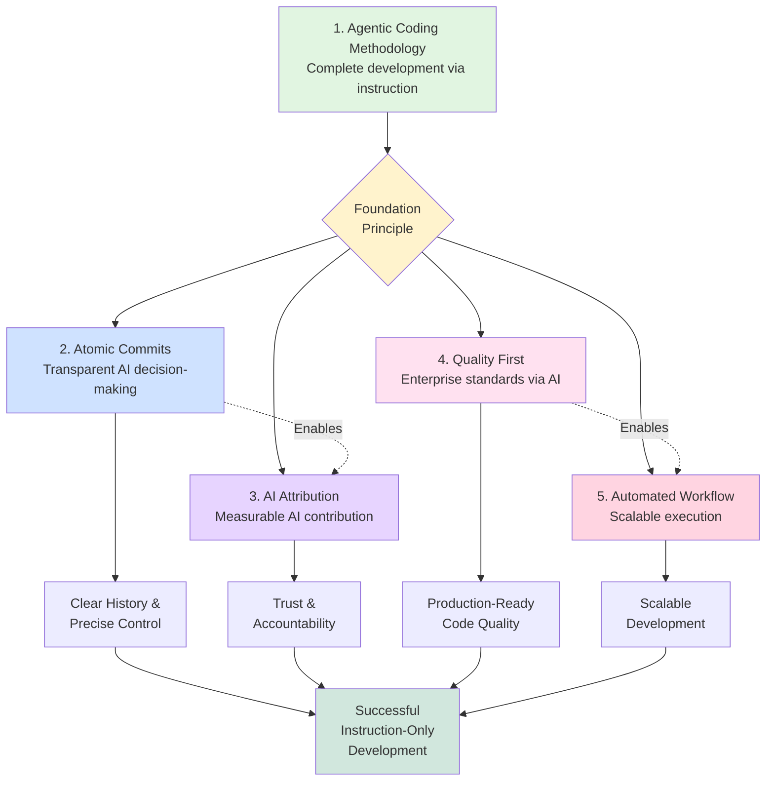
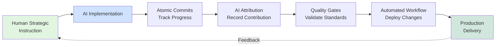

# Development Principles

## Purpose

This document explains the strategic principles guiding all development in the Todo App project. These principles define
WHY we work the way we do and HOW they support the instruction-only development methodology.

## Relationship to Other Documentation

- **This Document (principles.md)**: WHY - Philosophy, methodology, and strategic importance
- **[workflows.md](workflows.md)**: HOW - Git workflow, commit strategy, PR protocol, quality gates
- **[../adr/](../adr/)**: DECISIONS - Specific technical choices with rationale

## The Five Core Principles

### 1. Agentic Coding Methodology (The Foundation)

**Philosophy**: Complete software development through strategic instruction rather than manual coding

**Why This Matters**:

In traditional development, humans write code directly. This project demonstrates a paradigm shift where:

- **AI handles complete implementation** via natural language instruction
- **Humans focus on strategy** (what and why) while AI handles tactics (how and when)
- **Professional standards are maintained** entirely through AI execution
- **100% AI-generated codebase** proves instruction-only development viability

This is not "AI assistance" - it's **complete lifecycle development via instruction**, from planning through production
deployment.

**Core Components**:

1. **Pure Instruction Implementation**: All development occurs through natural language rather than manual coding
2. **Strategic vs. Tactical Separation**: Human provides requirements, AI handles all technical execution
3. **Professional Standards Maintenance**: Enterprise-quality practices (TDD, CI/CD, documentation) maintained by AI
4. **Complete Lifecycle Coverage**: From initial planning to production deployment via instruction-only workflow
5. **Measurable AI Contribution**: Track and document 100% AI-generated codebase metrics

**Role Boundaries**: See [README.md Role Definition](../../README.md#-role-definition-and-boundaries) for the
authoritative breakdown of human vs. AI responsibilities.

---

### 2. Atomic Commits

**Philosophy**: Clear history enables clear understanding and precise control

**Why This Matters**:

In instruction-only development, commit history is the primary record of AI decision-making and implementation
progression. Each commit represents:

- **A checkpoint in the AI's reasoning process** - showing how it broke down the problem
- **A rollback point without losing valuable work** - precise undo capability
- **Traceability for debugging** - pinpoint exactly which change introduced an issue
- **Learning record** - demonstrates AI's systematic approach to problem-solving

Atomic commits transform the git history from a chronological log into a **narrative of AI problem-solving**.

**Core Practices**:

- Each commit addresses a single, focused change
- Follow conventional commit format (feat, fix, docs, test, refactor, etc.)
- Include issue number for traceability (#issue-number)
- Multiple commits per feature show logical progression
- Commit messages explain WHY, not just WHAT

**Example Multi-Step Feature** (from [workflows.md](workflows.md#tdd-commit-pattern)):

```bash
# Red: Write failing test
git commit -m "test: add failing test for feature X (#33)"

# Green: Make test pass
git commit -m "feat: implement minimal feature X functionality (#33)"

# Refactor: Improve without changing behavior
git commit -m "refactor: optimize feature X implementation (#33)"

# Repeat cycle for additional functionality
git commit -m "test: add edge cases for feature X (#33)"
git commit -m "feat: handle edge cases in feature X (#33)"
```

---

### 3. AI Attribution

**Philosophy**: Transparent collaboration between human strategy and AI implementation

**Why This Matters**:

This project generates a **100% AI-implemented codebase**. Proper attribution serves multiple critical purposes:

- **Trust and Accountability**: Clear record of who did what (human strategy vs. AI implementation)
- **Transparency**: Anyone reading the history understands the development methodology
- **Credit**: Humans get credit for strategic direction, AI gets credit for technical execution
- **Measurable Results**: Creates quantifiable record of instruction-only development success
- **Future Reference**: Demonstrates proven patterns for AI-driven development

Without attribution, the methodology's success would be invisible in the codebase history.

**Attribution Format** (from [workflows.md](workflows.md#ai-agent-attribution)):

```text
type(scope): description (#issue-number)

Optional body explaining the change in detail.

🤖 Generated with AI Agent

Co-Authored-By: [Human Name] <human.email@domain.com>
```

**Required Elements**:

1. **Commit Author**: AI Agent account (mikiwiik-agent)
2. **Footer Marker**: `🤖 Generated with AI Agent`
3. **Co-Author**: Human collaborator with proper credit
4. **Conventional Format**: Standard commit message structure

---

### 4. Quality First

**Philosophy**: Enterprise standards maintained entirely through AI

**Why This Matters**:

One common concern about AI-generated code is quality. This project **proves AI can maintain professional-grade
standards** when properly instructed and equipped with quality gates.

Quality gates allow safe auto-merge without human verification, proving AI can maintain enterprise standards.

For thresholds, enforcement, and definition of done, see [Quality Standards](quality-standards.md).

---

### 5. Automated Workflow

**Philosophy**: Eliminate manual intervention to scale instruction-only development

**Why This Matters**:

Automation is the **force multiplier** for instruction-only development. Without automation:

- Each PR would require manual quality verification
- Human would need to run tests, lint, type-check before every commit
- Merge process would require manual intervention
- Issue tracking would need manual status updates

With automation, **AI can handle complete development lifecycle** with minimal human touchpoints.

The result: **Human provides strategic instruction, automation handles all tactical verification**.

Four automation layers — pre-commit hooks, CI pipeline, auto-merge protocol, and GitHub Projects — ensure quality
without manual intervention. For configuration details, see [workflows.md](workflows.md#quality-gates) and
[github-projects-setup.md](../setup/github-projects-setup.md).

---

## Principle Interdependencies

The five principles work together to enable instruction-only development:


```mermaid
graph TB
    Agentic[1. Agentic Coding Methodology<br/>Complete development via instruction] --> Foundation{Foundation<br/>Principle}

    Foundation --> Atomic[2. Atomic Commits<br/>Transparent AI decision-making]
    Foundation --> Attribution[3. AI Attribution<br/>Measurable AI contribution]
    Foundation --> Quality[4. Quality First<br/>Enterprise standards via AI]
    Foundation --> Automation[5. Automated Workflow<br/>Scalable execution]

    Atomic -.Enables.-> Attribution
    Quality -.Enables.-> Automation

    Atomic --> Traceability[Clear History &<br/>Precise Control]
    Attribution --> Transparency[Trust &<br/>Accountability]
    Quality --> Confidence[Production-Ready<br/>Code Quality]
    Automation --> Scale[Scalable<br/>Development]

    Traceability --> Success[Successful<br/>Instruction-Only<br/>Development]
    Transparency --> Success
    Confidence --> Success
    Scale --> Success

    style Agentic fill:#e1f5e1
    style Foundation fill:#fff3cd
    style Success fill:#d1e7dd
    style Atomic fill:#cfe2ff
    style Attribution fill:#e7d4ff
    style Quality fill:#ffe1f0
    style Automation fill:#ffd4e1
```

**How Principles Support Each Other**:

1. **Agentic Methodology (#1)** is the foundation - all other principles exist to support it
2. **Atomic Commits (#2)** enable **AI Attribution (#3)** - can't attribute what you can't identify
3. **Quality First (#4)** enables **Automated Workflow (#5)** - can't automate without quality gates
4. **All four supporting principles** prove that **Agentic Methodology** works at enterprise scale

## How Principles Support Instruction-Only Methodology

### The Instruction-Only Development Cycle


```mermaid
graph LR
    Human[Human Strategic<br/>Instruction] --> AI[AI Implementation]
    AI --> Atomic[Atomic Commits<br/>Track Progress]
    Atomic --> Attribution[AI Attribution<br/>Record Contribution]
    Attribution --> Quality[Quality Gates<br/>Validate Standards]
    Quality --> Automation[Automated Workflow<br/>Deploy Changes]
    Automation --> Delivery[Production<br/>Delivery]
    Delivery -.Feedback.-> Human

    style Human fill:#e1f5e1
    style AI fill:#cfe2ff
    style Delivery fill:#d1e7dd
```

**The Cycle in Action**:

1. **Human provides instruction**: "Add drag-and-drop reordering for todos"
2. **AI implements with atomic commits**: Test → Implementation → Refactor sequence
3. **AI attribution records contribution**: Each commit clearly marked as AI-generated
4. **Quality gates validate**: Pre-commit hooks + CI pipeline verify standards
5. **Automation completes workflow**: Auto-merge + branch cleanup + status updates
6. **Feature delivered to production**: Without any manual coding or quality verification

This demonstrates: **Natural language instruction → Production-ready feature** with professional standards maintained
throughout.

## See Also

- **[workflows.md](workflows.md)** - Git workflow, commits, PR protocol, quality gates
- **[quality-standards.md](quality-standards.md)** - Thresholds, enforcement, definition of done
- **[../../CLAUDE.md](../../CLAUDE.md)** - Essential guiding principles for AI agents
- **[../diagrams/development-workflow.md](../diagrams/development-workflow.md)** - Process visualization
