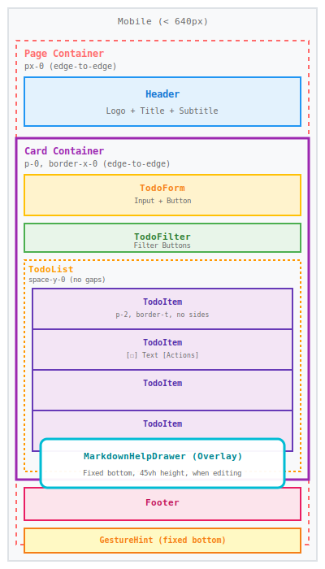

# Component Layout Reference

**Status**: Living Document
**Last Updated**: 2025-10-03
**Purpose**: Visual reference for UI component names and positioning
**Related**: [UI Layout Hierarchy](./ui-layout-hierarchy.md), [Mobile UX Guidelines](../guidelines/mobile-ux-guidelines.md)

## Purpose

This document provides visual diagrams showing all main UI components and their names for easy reference
in conversations. Use these names when discussing layout changes: "Page Container", "Card Container",
"TodoItem", etc.

## Component Reference

### Structural Components

| Component          | Description                                                       | File Location     |
| ------------------ | ----------------------------------------------------------------- | ----------------- |
| **Page Container** | Outermost wrapper for entire screen                               | `app/page.tsx:41` |
| **Header**         | Logo, title, and subtitle                                         | `app/page.tsx:42` |
| **Card Container** | Main content area (white card on desktop, edge-to-edge on mobile) | `app/page.tsx:61` |
| **Footer**         | Bottom credits                                                    | `app/page.tsx:92` |

### Interactive Components

| Component      | Description                                    | File Location                   |
| -------------- | ---------------------------------------------- | ------------------------------- |
| **TodoForm**   | Input field and "Add" button for new todos     | `app/components/TodoForm.tsx`   |
| **TodoFilter** | Filter buttons (All, Active, Completed, etc.)  | `app/components/TodoFilter.tsx` |
| **TodoList**   | Container for all todo items                   | `app/components/TodoList.tsx`   |
| **TodoItem**   | Individual todo item with checkbox and actions | `app/components/TodoItem.tsx`   |

### Overlay/Helper Components

| Component              | Description                                 | File Location                           | Platform              |
| ---------------------- | ------------------------------------------- | --------------------------------------- | --------------------- |
| **GestureHint**        | Fixed banner showing swipe/long-press hints | `app/components/GestureHint.tsx`        | Mobile only           |
| **MarkdownHelpDrawer** | Bottom overlay for markdown reference       | `app/components/MarkdownHelpDrawer.tsx` | Mobile (during edit)  |
| **MarkdownHelpBox**    | Inline collapsible markdown reference       | `app/components/MarkdownHelpBox.tsx`    | Desktop (during edit) |

## Mobile Layout (< 640px)



## Desktop Layout (≥ 640px)


## Key Layout Differences

### Mobile (< 640px)

- **Edge-to-edge layout**: No horizontal padding on Page Container (`px-0`) or Card Container (`p-0`)
- **Borders separate items**: TodoList uses `space-y-0` with `border-t` on items
- **Compact spacing**: TodoItem uses `p-2` (8px)
- **Fixed bottom elements**: GestureHint always visible at bottom
- **Overlay help**: MarkdownHelpDrawer slides up from bottom (45% viewport height)

### Desktop (≥ 640px)

- **Contained layout**: Page Container has `px-6` (24px), Card Container has `p-5` (20px)
- **Gaps between items**: TodoList uses `space-y-3` (12px)
- **Spacious padding**: TodoItem uses `p-4` (16px)
- **Rounded corners**: Card and TodoItems have `rounded-lg`
- **Inline help**: MarkdownHelpBox expands within TodoItem
- **More features visible**: Drag handles, reorder buttons

## Component Hierarchy

```text
Page Container (outermost wrapper)
├── Header (logo, title, subtitle)
├── Card Container (main content card)
│   ├── TodoForm (input + Add button)
│   ├── TodoFilter (filter buttons)
│   └── TodoList (todo items container)
│       └── TodoItem (individual todo)
│           ├── Checkbox
│           ├── Content
│           ├── Actions (Edit, Delete, etc.)
│           └── MarkdownHelpBox (desktop, when editing)
└── Footer (credits)

Additional (overlays/fixed position):
├── GestureHint (mobile only, fixed bottom)
└── MarkdownHelpDrawer (mobile only, portal overlay when editing)
```

## Usage in Conversations

When discussing layout changes, use these component names for clarity:

**Examples:**

- ✅ "Reduce padding in the **TodoItem** component"
- ✅ "The **Card Container** should be edge-to-edge on mobile"
- ✅ "Add spacing between the **TodoFilter** and **TodoList**"
- ✅ "The **MarkdownHelpDrawer** overlaps the **Footer**"
- ✅ "**Page Container** padding needs adjustment"

**Avoid vague terms:**

- ❌ "The main container" (which one?)
- ❌ "The list area" (TodoList or TodoItem?)
- ❌ "The top section" (Header or Card Container?)

## Related Documentation

- [UI Layout Hierarchy](./ui-layout-hierarchy.md) - Detailed spacing breakdown and pixel values
- [Spacing Breakdown](./spacing-breakdown/README.md) - Visual spacing diagrams with measurements
- [Mobile UX Guidelines](../guidelines/mobile-ux-guidelines.md) - Mobile-first spacing strategy
- [Accessibility Requirements](../guidelines/accessibility-requirements.md) - Touch target requirements

---

**Use this diagram as a reference when discussing layout changes to ensure clear communication about
which component needs adjustment.**
