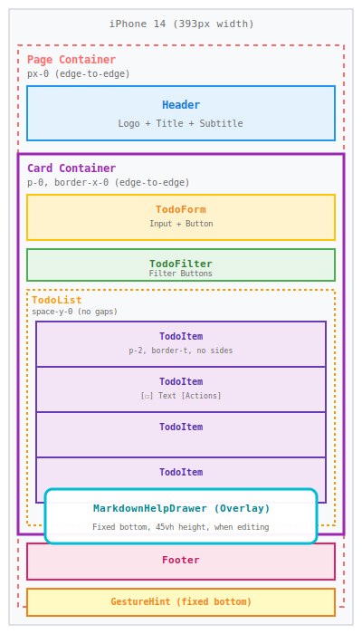
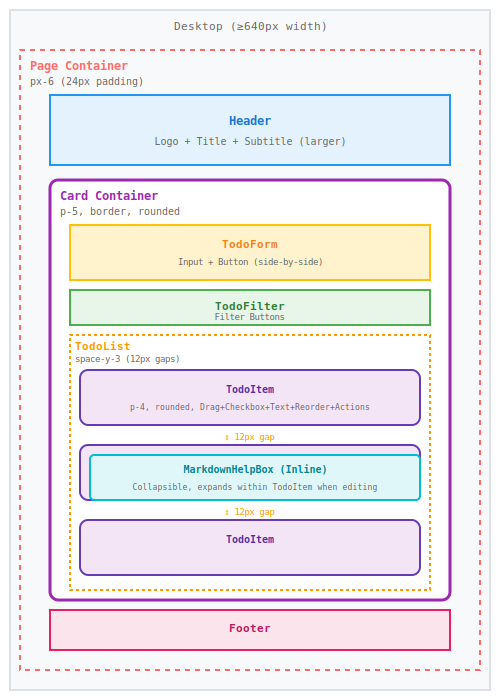
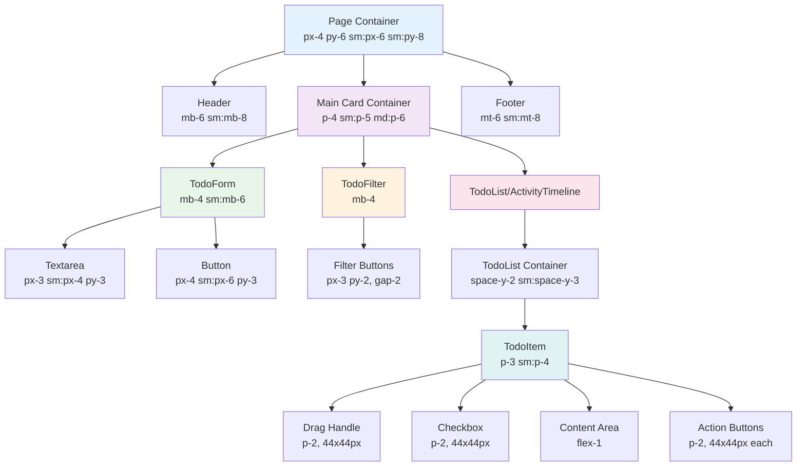

# Layout and Spacing Reference

**Status**: Living Document
**Last Updated**: 2025-10-04
**Purpose**: Complete visual and technical reference for UI components, layout, and spacing
**Related**: [Mobile UX Guidelines](../guidelines/mobile-ux-guidelines.md), [Accessibility
Requirements](../guidelines/accessibility-requirements.md)

---

## Table of Contents

1. [Quick Visual Reference](#quick-visual-reference) - Component diagrams
2. [Component Reference](#component-reference) - Tables with file locations
3. [Spacing System Overview](#spacing-system-overview) - Layers, scale, and breakpoints
4. [Layout Breakdowns](#layout-breakdowns) - Mobile and desktop spacing diagrams
5. [Component Details](#component-details) - Implementation specifics for each component
6. [Distance Calculations](#distance-calculations) - Screen edge to content measurements
7. [Common Scenarios](#common-scenarios) - "What creates what"
8. [Usage in Conversations](#usage-in-conversations) - Communication guidelines
9. [Related Documentation](#related-documentation)

---

## Quick Visual Reference

### SVG Diagrams

#### Mobile Layout (< 640px)



#### Desktop Layout (≥ 640px)



### Component Hierarchy



---

## Component Reference

### Structural Components

| Component          | Description                                                       | File Location  |
| ------------------ | ----------------------------------------------------------------- | -------------- |
| **Page Container** | Outermost wrapper for entire screen                               | `app/page.tsx` |
| **Header**         | Logo, title, and subtitle                                         | `app/page.tsx` |
| **Card Container** | Main content area (white card on desktop, edge-to-edge on mobile) | `app/page.tsx` |
| **Footer**         | Bottom credits                                                    | `app/page.tsx` |

### Interactive Components

| Component      | Description                                    | File Location                   |
| -------------- | ---------------------------------------------- | ------------------------------- |
| **TodoForm**   | Input field and "Add" button for new todos     | `app/components/TodoForm.tsx`   |
| **TodoFilter** | Filter buttons (All, Active, Completed, etc.)  | `app/components/TodoFilter.tsx` |
| **TodoList**   | Container for all todo items                   | `app/components/TodoList.tsx`   |
| **TodoItem**   | Individual todo item with checkbox and actions | `app/components/TodoItem.tsx`   |

### Overlay/Helper Components

| Component              | Description                                 | File Location                           | Platform              |
| ---------------------- | ------------------------------------------- | --------------------------------------- | --------------------- |
| **GestureHint**        | Fixed banner showing swipe/long-press hints | `app/components/GestureHint.tsx`        | Mobile only           |
| **MarkdownHelpDrawer** | Bottom overlay for markdown reference       | `app/components/MarkdownHelpDrawer.tsx` | Mobile (during edit)  |
| **MarkdownHelpBox**    | Inline collapsible markdown reference       | `app/components/MarkdownHelpBox.tsx`    | Desktop (during edit) |

---

## Spacing System Overview

### Key Concept: Layers of Spacing

The application uses **nested spacing layers** that combine to create the final visual layout:

```text
Screen Edge
  ↓ Page Padding (px-0 mobile / px-6 desktop - edge-to-edge on mobile)
Container Boundary
  ↓ Card Padding (p-0 mobile / p-5 desktop - edge-to-edge on mobile)
Component Boundary
  ↓ Item Padding (p-2 mobile / p-4 desktop)
Content
```

### Spacing Scale Reference

| Tailwind Class | Pixel Value | Common Usage                          |
| -------------- | ----------- | ------------------------------------- |
| `p-0`          | 0px         | Edge-to-edge (page/card mobile)       |
| `p-1.5`        | 6px         | Compact button padding (mobile)       |
| `p-2`          | 8px         | Mobile item padding                   |
| `p-4`          | 16px        | Desktop item padding                  |
| `p-5`          | 20px        | Desktop small container               |
| `p-6`          | 24px        | Desktop medium container              |
| `p-8`          | 32px        | Large spacing                         |
| `gap-0.5`      | 2px         | Tight button group gap (mobile)       |
| `gap-1`        | 4px         | Desktop button group gap              |
| `gap-2`        | 8px         | Standard gap (filters, item internal) |
| `gap-3`        | 12px        | Larger gap (desktop items)            |
| `space-y-0`    | 0px         | Mobile list (borders separate items)  |
| `space-y-3`    | 12px        | Desktop list vertical spacing         |

### Responsive Breakpoints

| Breakpoint | Min Width | Tailwind Prefix | Typical Use Case            |
| ---------- | --------- | --------------- | --------------------------- |
| Mobile     | 0px       | (default)       | iPhone 14 (393px) and up    |
| Small      | 640px     | `sm:`           | Large phones, small tablets |
| Medium     | 768px     | `md:`           | Tablets                     |
| Large      | 1024px    | `lg:`           | Desktops                    |

---

## Layout Breakdowns

### Mobile Layout (< 640px)

#### Full Page Breakdown

```text
┌─────────────────────────────────────────────────────────────────┐
│ SCREEN EDGE (0px)                                               │
│ ════════════════════════════════════════════════════════════════│
│ ▒▒▒▒▒▒▒▒▒▒▒▒▒▒▒▒▒▒▒▒▒▒ 0px (px-0) ▒▒▒▒▒▒▒▒▒▒▒▒▒▒▒▒▒▒▒▒▒▒▒▒▒▒▒▒▒▒│ Page
│ ▒┌──────────────────────────────────────────────────────────┐▒│ Padding
│ ▒│ HEADER                                                   │▒│ EDGE-TO-EDGE
│ ▒│ [CheckSquare Icon] Todo App                             │▒│
│ ▒│ A Next.js Todo application...                           │▒│
│ ▒└──────────────────────────────────────────────────────────┘▒│
│ ▒▒▒▒▒▒▒▒▒▒▒▒▒▒▒▒▒▒▒▒▒▒▒▒▒▒▒▒▒▒▒▒▒▒▒▒▒▒▒▒▒▒▒▒▒▒▒▒▒▒▒▒▒▒▒▒▒▒▒▒▒▒▒│
│ ▒                     24px (mb-6)                            ▒│ Header
│ ▒▒▒▒▒▒▒▒▒▒▒▒▒▒▒▒▒▒▒▒▒▒▒▒▒▒▒▒▒▒▒▒▒▒▒▒▒▒▒▒▒▒▒▒▒▒▒▒▒▒▒▒▒▒▒▒▒▒▒▒▒▒▒│ Margin
│ ▒┌──────────────────────────────────────────────────────────┐▒│
│ ▒│ CARD BORDER ┌────────────────────────────────────────┐   │▒│
│ ▒│             │ ░░░░░ 0px (p-0) ░░░░░░░░░░░░░░░░░░░░░░░│   │▒│ Card
│ ▒│             │ ░┌────────────────────────────────────┐░│   │▒│ Padding
│ ▒│             │ ░│ TodoForm                           │░│   │▒│ EDGE-TO-EDGE
│ ▒│             │ ░│ ┌────────────────────────────────┐ │░│   │▒│
│ ▒│             │ ░│ │ 12px (px-3) → Textarea ← 12px  │ │░│   │▒│ Form
│ ▒│             │ ░│ └────────────────────────────────┘ │░│   │▒│ Textarea
│ ▒│             │ ░│            [Add Todo Button]       │░│   │▒│ Padding
│ ▒│             │ ░└────────────────────────────────────┘░│   │▒│
│ ▒│             │ ░░░░░░░░░░░░░░░░░░░░░░░░░░░░░░░░░░░░░░░░│   │▒│
│ ▒│             │              16px (mb-4)               │   │▒│ Form
│ ▒│             │ ░░░░░░░░░░░░░░░░░░░░░░░░░░░░░░░░░░░░░░░░│   │▒│ Margin
│ ▒│             │ ░┌────────────────────────────────────┐░│   │▒│
│ ▒│             │ ░│ TodoFilter                         │░│   │▒│
│ ▒│             │ ░│ [All] [Active] [Completed] [...]   │░│   │▒│
│ ▒│             │ ░└────────────────────────────────────┘░│   │▒│
│ ▒│             │ ░░░░░░░░░░░░░░░░░░░░░░░░░░░░░░░░░░░░░░░░│   │▒│
│ ▒│             │              16px (mb-4)               │   │▒│ Filter
│ ▒│             │ ░░░░░░░░░░░░░░░░░░░░░░░░░░░░░░░░░░░░░░░░│   │▒│ Margin
│ ▒│             │ ░┌────────────────────────────────────┐░│   │▒│
│ ▒│             │ ░│ TodoList                           │░│   │▒│
│ ▒│             │ ░│ ┌──────────────────────────────┐   │░│   │▒│
│ ▒│             │ ░│ │▓▓ 8px (p-2) ▓▓▓▓▓▓▓▓▓▓▓▓▓▓▓▓▓│   │░│   │▒│
│ ▒│             │ ░│ │▓[☐] Buy milk          [Edit]▓│   │░│   │▒│ TodoItem
│ ▒│             │ ░│ │▓▓▓▓▓▓▓▓▓▓▓▓▓▓▓▓▓▓▓▓▓▓▓▓▓ 8px▓│   │░│   │▒│ Padding
│ ▒│             │ ░│ ├──────────────────────────────┤   │░│   │▒│ ← BORDER-TOP
│ ▒│             │ ░│ │          0px (space-y-0)     │   │░│   │▒│ ← (borders
│ ▒│             │ ░│ ├──────────────────────────────┤   │░│   │▒│ ← separate
│ ▒│             │ ░│ │▓▓ 8px (p-2) ▓▓▓▓▓▓▓▓▓▓▓▓▓▓▓▓▓│   │░│   │▒│ ← items)
│ ▒│             │ ░│ │▓[☐] Walk dog          [Edit]▓│   │░│   │▒│
│ ▒│             │ ░│ │▓▓▓▓▓▓▓▓▓▓▓▓▓▓▓▓▓▓▓▓▓▓▓▓▓ 8px▓│   │░│   │▒│
│ ▒│             │ ░│ └──────────────────────────────┘   │░│   │▒│
│ ▒│             │ ░└────────────────────────────────────┘░│   │▒│
│ ▒│             │ ░░░░░░░░░░░░░░░░░░░░░░░░░░░░░░░░░░░░░░░░│   │▒│
│ ▒│             └────────────────────────────────────────┘   │▒│
│ ▒└──────────────────────────────────────────────────────────┘▒│
│ ▒▒▒▒▒▒▒▒▒▒▒▒▒▒▒▒▒▒▒▒▒▒▒▒▒▒▒▒▒▒▒▒▒▒▒▒▒▒▒▒▒▒▒▒▒▒▒▒▒▒▒▒▒▒▒▒▒▒▒▒▒▒▒│
│ ▒                     24px (mt-6)                            ▒│ Footer
│ ▒▒▒▒▒▒▒▒▒▒▒▒▒▒▒▒▒▒▒▒▒▒▒▒▒▒▒▒▒▒▒▒▒▒▒▒▒▒▒▒▒▒▒▒▒▒▒▒▒▒▒▒▒▒▒▒▒▒▒▒▒▒▒│ Margin
│ ▒┌──────────────────────────────────────────────────────────┐▒│
│ ▒│ FOOTER                                                   │▒│
│ ▒│ Built with ❤️ using Claude Code                          │▒│
│ ▒└──────────────────────────────────────────────────────────┘▒│
│ ▒▒▒▒▒▒▒▒▒▒▒▒▒▒▒▒▒▒▒▒▒▒▒▒▒▒▒▒▒▒▒▒▒▒▒▒▒▒▒▒▒▒▒▒▒▒▒▒▒▒▒▒▒▒▒▒▒▒▒▒▒▒▒│
│ ════════════════════════════════════════════════════════════════│
└─────────────────────────────────────────────────────────────────┘

Legend:
▒▒▒ = Page padding (px-0 = 0px horizontal - EDGE-TO-EDGE LAYOUT)
░░░ = Card padding (p-0 = 0px all sides - EDGE-TO-EDGE LAYOUT)
▓▓▓ = TodoItem padding (p-2 = 8px all sides)
```

### Desktop Layout (≥ 640px)

#### Full Page Breakdown

```text
┌─────────────────────────────────────────────────────────────────────┐
│ SCREEN EDGE (0px)                                                   │
│ ════════════════════════════════════════════════════════════════════│
│ ▒▒▒▒▒▒▒▒▒▒▒▒▒▒▒▒▒▒ 24px (px-6) ▒▒▒▒▒▒▒▒▒▒▒▒▒▒▒▒▒▒▒▒▒▒▒▒▒▒▒▒▒▒▒▒▒▒▒▒▒│ Page
│ ▒┌──────────────────────────────────────────────────────────────┐▒│ Padding
│ ▒│ HEADER (larger text, more spacing)                          │▒│ (contained)
│ ▒│ [CheckSquare Icon] Todo App                                 │▒│
│ ▒│ A Next.js Todo application built with TDD                   │▒│
│ ▒└──────────────────────────────────────────────────────────────┘▒│
│ ▒▒▒▒▒▒▒▒▒▒▒▒▒▒▒▒▒▒▒▒▒▒▒▒▒▒▒▒▒▒▒▒▒▒▒▒▒▒▒▒▒▒▒▒▒▒▒▒▒▒▒▒▒▒▒▒▒▒▒▒▒▒▒▒▒▒▒│
│ ▒                       32px (mb-8)                              ▒│ Header
│ ▒▒▒▒▒▒▒▒▒▒▒▒▒▒▒▒▒▒▒▒▒▒▒▒▒▒▒▒▒▒▒▒▒▒▒▒▒▒▒▒▒▒▒▒▒▒▒▒▒▒▒▒▒▒▒▒▒▒▒▒▒▒▒▒▒▒▒│ Margin
│ ▒┌──────────────────────────────────────────────────────────────┐▒│
│ ▒│ CARD BORDER ┌────────────────────────────────────────────┐   │▒│
│ ▒│  (rounded)  │ ░░░░░░░░ 20px (p-5) ░░░░░░░░░░░░░░░░░░░░░░│   │▒│ Card
│ ▒│             │ ░┌────────────────────────────────────────┐░│   │▒│ Padding
│ ▒│             │ ░│ TodoForm                               │░│   │▒│ (contained)
│ ▒│             │ ░│ ┌──────────────────────────────────┐   │░│   │▒│
│ ▒│             │ ░│ │ 16px (px-4) → Textarea ← 16px    │   │░│   │▒│ Form
│ ▒│             │ ░│ └──────────────────────────────────┘   │░│   │▒│ Textarea
│ ▒│             │ ░│          [Add Todo Button]             │░│   │▒│ Padding
│ ▒│             │ ░└────────────────────────────────────────┘░│   │▒│
│ ▒│             │ ░░░░░░░░░░░░░░░░░░░░░░░░░░░░░░░░░░░░░░░░░░░░│   │▒│
│ ▒│             │              24px (mb-6)                   │   │▒│ Form
│ ▒│             │ ░░░░░░░░░░░░░░░░░░░░░░░░░░░░░░░░░░░░░░░░░░░░│   │▒│ Margin
│ ▒│             │ ░┌────────────────────────────────────────┐░│   │▒│
│ ▒│             │ ░│ TodoFilter                             │░│   │▒│
│ ▒│             │ ░│ [All (5)] [Active (3)] [Completed (2)] │░│   │▒│
│ ▒│             │ ░└────────────────────────────────────────┘░│   │▒│
│ ▒│             │ ░░░░░░░░░░░░░░░░░░░░░░░░░░░░░░░░░░░░░░░░░░░░│   │▒│
│ ▒│             │              16px (mb-4)                   │   │▒│ Filter
│ ▒│             │ ░░░░░░░░░░░░░░░░░░░░░░░░░░░░░░░░░░░░░░░░░░░░│   │▒│ Margin
│ ▒│             │ ░┌────────────────────────────────────────┐░│   │▒│
│ ▒│             │ ░│ TodoList                               │░│   │▒│
│ ▒│             │ ░│ ┌──────────────────────────────────┐   │░│   │▒│
│ ▒│             │ ░│ │▓▓▓ 16px (p-4) ▓▓▓▓▓▓▓▓▓▓▓▓▓▓▓▓▓▓│   │░│   │▒│
│ ▒│             │ ░│ │▓[☰][☐] Buy milk [↑][↓][Edit][×]▓│   │░│   │▒│ TodoItem
│ ▒│             │ ░│ │▓▓▓▓▓▓▓▓▓▓▓▓▓▓▓▓▓▓▓▓▓▓▓▓▓▓▓▓ 16px▓│   │░│   │▒│ Padding
│ ▒│             │ ░│ └──────────────────────────────────┘   │░│   │▒│ (rounded)
│ ▒│             │ ░│          12px (space-y-3)              │░│   │▒│ ← GAP
│ ▒│             │ ░│ ┌──────────────────────────────────┐   │░│   │▒│ ← between
│ ▒│             │ ░│ │▓▓▓ 16px (p-4) ▓▓▓▓▓▓▓▓▓▓▓▓▓▓▓▓▓▓│   │░│   │▒│ ← items
│ ▒│             │ ░│ │▓[☰][☐] Walk dog [↑][↓][Edit][×]▓│   │░│   │▒│
│ ▒│             │ ░│ │▓▓▓▓▓▓▓▓▓▓▓▓▓▓▓▓▓▓▓▓▓▓▓▓▓▓▓▓ 16px▓│   │░│   │▒│
│ ▒│             │ ░│ └──────────────────────────────────┘   │░│   │▒│
│ ▒│             │ ░└────────────────────────────────────────┘░│   │▒│
│ ▒│             │ ░░░░░░░░░░░░░░░░░░░░░░░░░░░░░░░░░░░░░░░░░░░░│   │▒│
│ ▒│             └────────────────────────────────────────────┘   │▒│
│ ▒└──────────────────────────────────────────────────────────────┘▒│
│ ▒▒▒▒▒▒▒▒▒▒▒▒▒▒▒▒▒▒▒▒▒▒▒▒▒▒▒▒▒▒▒▒▒▒▒▒▒▒▒▒▒▒▒▒▒▒▒▒▒▒▒▒▒▒▒▒▒▒▒▒▒▒▒▒▒▒▒│
│ ▒                       32px (mt-8)                              ▒│ Footer
│ ▒▒▒▒▒▒▒▒▒▒▒▒▒▒▒▒▒▒▒▒▒▒▒▒▒▒▒▒▒▒▒▒▒▒▒▒▒▒▒▒▒▒▒▒▒▒▒▒▒▒▒▒▒▒▒▒▒▒▒▒▒▒▒▒▒▒▒│ Margin
│ ▒┌──────────────────────────────────────────────────────────────┐▒│
│ ▒│ FOOTER                                                       │▒│
│ ▒│ Built with ❤️ using Claude Code                              │▒│
│ ▒└──────────────────────────────────────────────────────────────┘▒│
│ ▒▒▒▒▒▒▒▒▒▒▒▒▒▒▒▒▒▒▒▒▒▒▒▒▒▒▒▒▒▒▒▒▒▒▒▒▒▒▒▒▒▒▒▒▒▒▒▒▒▒▒▒▒▒▒▒▒▒▒▒▒▒▒▒▒▒▒│
│ ════════════════════════════════════════════════════════════════════│
└─────────────────────────────────────────────────────────────────────┘

Legend:
▒▒▒ = Page padding (px-6 = 24px horizontal)
░░░ = Card padding (p-5 = 20px all sides)
▓▓▓ = TodoItem padding (p-4 = 16px all sides)
```

### Spacing Measurements

Responsive spacing values showing how layouts differ between mobile and desktop:

| Visual Gap               | Created By    | Mobile Tailwind | Mobile px | Desktop Tailwind | Desktop px | Component      |
| ------------------------ | ------------- | --------------- | --------- | ---------------- | ---------- | -------------- |
| Screen edge → Header     | Page padding  | `px-0`          | 0px       | `px-6`           | 24px       | Page Container |
| Header → Card            | Header margin | `mb-6`          | 24px      | `mb-8`           | 32px       | Header         |
| Card border → Form       | Card padding  | `p-0`           | 0px       | `p-5`            | 20px       | Card Container |
| Form → Filter            | Form margin   | `mb-4`          | 16px      | `mb-6`           | 24px       | TodoForm       |
| Filter → List            | Filter margin | `mb-4`          | 16px      | `mb-4`           | 16px       | TodoFilter     |
| Todo item → Todo item    | List gap      | `space-y-0`     | 0px       | `space-y-3`      | 12px       | TodoList       |
| Item border → Content    | Item padding  | `p-2`           | 8px       | `p-4`            | 16px       | TodoItem       |
| Content internal spacing | Internal gap  | `gap-2`         | 8px       | `gap-3`          | 12px       | TodoItem       |
| Text → Actions           | Internal gap  | `gap-2`         | 8px       | `gap-3`          | 12px       | TodoItem       |
| Card → Footer            | Card margin   | `mt-6`          | 24px      | `mt-8`           | 32px       | Card Container |

### Key Layout Differences

#### Mobile (< 640px)

- **Edge-to-edge layout**: No horizontal padding on Page Container (`px-0`) or Card Container (`p-0`)
- **Borders separate items**: TodoList uses `space-y-0` with `border-t` on items
- **Compact spacing**: TodoItem uses `p-2` (8px)
- **Flat appearance**: No rounded corners (`rounded-none`)
- **Fixed bottom elements**: GestureHint always visible at bottom
- **Overlay help**: MarkdownHelpDrawer slides up from bottom (45% viewport height)

#### Desktop (≥ 640px)

- **Contained layout**: Page Container has `px-6` (24px), Card Container has `p-5` (20px)
- **Gaps between items**: TodoList uses `space-y-3` (12px)
- **Spacious padding**: TodoItem uses `p-4` (16px)
- **Rounded corners**: Card and TodoItems have `rounded-lg`
- **Full borders**: Items have complete borders on all sides
- **Inline help**: MarkdownHelpBox expands within TodoItem
- **More features visible**: Drag handles, reorder buttons

---

## Component Details

### 1. Page Container

**File**: `app/page.tsx`

| Property           | Mobile (default)          | Desktop (≥640px) |
| ------------------ | ------------------------- | ---------------- |
| Horizontal padding | `px-0` (0px edge-to-edge) | `px-6` (24px)    |
| Vertical padding   | `py-6` (24px)             | `py-8` (32px)    |

**Purpose**: Edge-to-edge on mobile for maximum content area; contained on desktop

### 2. Header

**File**: `app/page.tsx`

| Property             | Mobile (default) | Desktop (≥640px) |
| -------------------- | ---------------- | ---------------- |
| Bottom margin        | `mb-6` (24px)    | `mb-8` (32px)    |
| Logo + title wrapper | `mb-3` (12px)    | `mb-4` (16px)    |
| Icon + title gap     | `gap-2` (8px)    | `gap-3` (12px)   |

### 3. Main Card Container

**File**: `app/page.tsx`

| Property | Mobile (default)                     | Small (≥640px)            | Medium (≥768px) |
| -------- | ------------------------------------ | ------------------------- | --------------- |
| Padding  | `p-0` (0px, edge-to-edge)            | `p-5` (20px)              | `p-6` (24px)    |
| Borders  | `border-x-0` (no horizontal borders) | `border-x` (full borders) | (same)          |

**Purpose**: Edge-to-edge on mobile; contained card on desktop

### 4. TodoForm

**File**: `app/components/TodoForm.tsx`

| Property             | Mobile (default) | Desktop (≥640px) |
| -------------------- | ---------------- | ---------------- |
| Container margin     | `mb-4` (16px)    | `mb-6` (24px)    |
| Textarea padding (H) | `px-3` (12px)    | `px-4` (16px)    |
| Textarea padding (V) | `py-3` (12px)    | (same)           |
| Button padding (H)   | `px-4` (16px)    | `px-6` (24px)    |
| Button padding (V)   | `py-3` (12px)    | (same)           |

### 5. TodoFilter

**File**: `app/components/TodoFilter.tsx`

| Property           | Mobile (default) | Desktop (≥640px) |
| ------------------ | ---------------- | ---------------- |
| Container margin   | `mb-4` (16px)    | (same)           |
| Button padding (H) | `px-2` (8px)     | `px-3` (12px)    |
| Button padding (V) | `py-2` (8px)     | (same)           |
| Button gap         | `gap-2` (8px)    | (same)           |

### 6. TodoList

**File**: `app/components/TodoList.tsx`

| Property         | Mobile (default)                          | Desktop (≥640px)   |
| ---------------- | ----------------------------------------- | ------------------ |
| Vertical spacing | `space-y-0` (0px, borders separate items) | `space-y-3` (12px) |
| Empty state      | `py-8` (32px)                             | `py-12` (48px)     |

### 7. TodoItem

**File**: `app/components/TodoItem.tsx`

| Property         | Mobile (default)                             | Desktop (≥640px)        |
| ---------------- | -------------------------------------------- | ----------------------- |
| Padding          | `p-2` (8px all sides)                        | `p-4` (16px)            |
| Corner radius    | `rounded-none` (flat)                        | `rounded-lg`            |
| Borders          | `border-t` only (except first), `border-x-0` | Full `border` all sides |
| Main gap         | `gap-2` (8px)                                | `gap-3` (12px)          |
| Button group gap | `gap-0.5` (2px)                              | `gap-1` (4px)           |
| Button padding   | `p-1.5` (6px)                                | `p-2` (8px)             |

**Touch Targets**: All interactive elements maintain 44×44px minimum (WCAG 2.2 AA)

### 8. Footer

**File**: `app/page.tsx`

| Property   | Mobile (default) | Desktop (≥640px) |
| ---------- | ---------------- | ---------------- |
| Top margin | `mt-6` (24px)    | `mt-8` (32px)    |

---

## Distance Calculations

### Mobile (< 640px)

**Horizontal**:

- Screen edge → Page padding: **0px** (`px-0` - edge-to-edge)
- Page padding → Card border: **0px** (card spans full width)
- Card border → Card padding: **0px** (`p-0` - edge-to-edge)
- **Total from edge to content**: 0px (true edge-to-edge layout)

**Vertical**:

- Screen edge → Page padding: **24px** (`py-6`)
- Page padding → Header: **0px**
- Header → Header margin: **24px** (`mb-6`)
- **Total from top edge to card**: 48px

### Desktop (≥ 640px)

**Horizontal**:

- Screen edge → Page padding: **24px** (`px-6`)
- Page padding → Card border: **0px**
- Card border → Card padding: **20px** (`p-5`)
- **Total from edge to content**: 44px

**Vertical**:

- Screen edge → Page padding: **32px** (`py-8`)
- Page padding → Header: **0px**
- Header → Header margin: **32px** (`mb-8`)
- **Total from top edge to card**: 64px

---

## Common Scenarios

### Scenario 1: "Vertical whitespace in the list"

**What it IS**:

- The gap between TodoItem components
- Controlled by: **TodoList** component → `space-y-0 sm:space-y-3`
- Mobile: 0px (borders separate items), Desktop: 12px

**What it is NOT**:

- Padding inside TodoItem (that's `p-2 sm:p-4`)
- Margin around TodoList container (that's TodoFilter's `mb-4`)
- Space between item content and buttons (that's `gap-2 sm:gap-3`)
- Border-top on items (that's the visual separator on mobile)

### Scenario 2: "Horizontal spacing in items"

**What it IS**:

- Padding inside TodoItem creating space from border to content
- Controlled by: **TodoItem** component → `p-2 sm:p-4`
- Mobile: 8px, Desktop: 16px

**What it is NOT**:

- Gap between checkbox and text (that's `gap-2 sm:gap-3`)
- Page padding (that's `px-0 sm:px-6` - edge-to-edge on mobile)
- Card padding (that's `p-0 sm:p-5 md:p-6` - edge-to-edge on mobile)

### Scenario 3: "Distance from screen edge"

**What it IS**:

- **Layer 1**: Page padding (`px-0 sm:px-6`) = 0px/24px
- **Layer 2**: Card padding (`p-0 sm:p-5`) = 0px/20px
- **Total**: 0px (mobile - edge-to-edge) / 44px (desktop) from edge to content

**What it is NOT**:

- Just page padding alone
- Just card padding alone
- The gap between items
- Mobile uses edge-to-edge layout (0px from screen edge)

---

## Usage in Conversations

When discussing layout changes, use these component names and terminology for clarity:

### Component Naming Examples

**Good examples:**

- ✅ "Reduce padding in the **TodoItem** component"
- ✅ "The **Card Container** should be edge-to-edge on mobile"
- ✅ "Add spacing between the **TodoFilter** and **TodoList**"
- ✅ "The **MarkdownHelpDrawer** overlaps the **Footer**"
- ✅ "**Page Container** padding needs adjustment"

**Avoid vague terms:**

- ❌ "The main container" (which one?)
- ❌ "The list area" (TodoList or TodoItem?)
- ❌ "The top section" (Header or Card Container?)

### Spacing Terminology

**When discussing spacing changes:**

- ✅ "The vertical whitespace is `space-y-0 sm:space-y-3` in the **TodoList** component"
- ✅ "The horizontal padding is `p-2 sm:p-4` in the **TodoItem** component"
- ✅ "Edge-to-edge means `px-0` and `p-0` on mobile - 0px from screen edge"

**Reference format:**

- **Component name** (e.g., "TodoItem", "TodoList")
- **Specific padding/margin** (e.g., "the p-2 mobile padding", "the space-y-3 gap")
- **Visual diagrams** from this document for context

**Example**: "We need to add vertical whitespace in the TodoList on mobile - that's the
`space-y-0 sm:space-y-3`, currently 0px mobile (borders separate) / 12px desktop"

---

## Related Documentation

- [Mobile UX Guidelines](../guidelines/mobile-ux-guidelines.md) - Mobile-first spacing strategy and best
  practices
- [Accessibility Requirements](../guidelines/accessibility-requirements.md) - Touch target requirements
  (44×44px minimum)
- [Issue #163](https://github.com/user/repo/issues/163) - Mobile UX improvements context
- [PR #166](https://github.com/user/repo/pulls/166) - Mobile UX implementation
- [Issue #169](https://github.com/user/repo/issues/169) - Layout documentation improvements

---

**Use this document as a complete reference for both quick visual lookup and deep technical understanding
of spacing mechanics.**
