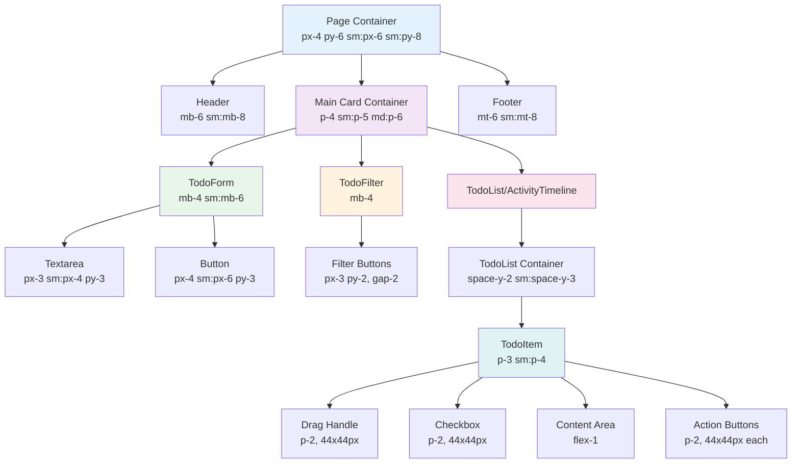

# UI Layout Hierarchy

**Status**: Living Document
**Last Updated**: 2025-10-03
**Related**:
[Mobile UX Guidelines](../guidelines/mobile-ux-guidelines.md),
[Issue #163](https://github.com/user/repo/issues/163),
[Issue #169](https://github.com/user/repo/issues/169)

## Purpose

This document provides visual documentation of the application's UI layout hierarchy and spacing
model to improve communication about layout changes and eliminate ambiguity when discussing
spacing adjustments.

## Component Hierarchy

### Visual Diagram



## Box Model Diagrams

### Mobile Layout (< 640px)

```text
┌─────────────────────────────────────────────────────────┐
│ Page Container (px-4 py-6 = 16px horizontal, 24px vert) │
│ ┌─────────────────────────────────────────────────────┐ │
│ │ Header (mb-6 = 24px bottom margin)                  │ │
│ └─────────────────────────────────────────────────────┘ │
│                                                           │
│ ┌─────────────────────────────────────────────────────┐ │
│ │ Main Card Container (p-4 = 16px all sides)          │ │
│ │ ┌─────────────────────────────────────────────────┐ │ │
│ │ │ TodoForm (mb-4 = 16px bottom)                   │ │ │
│ │ │ ┌─────────────────────────────────────────────┐ │ │ │
│ │ │ │ Textarea (px-3 py-3 = 12px horiz, 12px vert)│ │ │ │
│ │ │ └─────────────────────────────────────────────┘ │ │ │
│ │ └─────────────────────────────────────────────────┘ │ │
│ │                                                       │ │
│ │ ┌─────────────────────────────────────────────────┐ │ │
│ │ │ TodoFilter (mb-4 = 16px bottom, gap-2 = 8px)    │ │ │
│ │ │ [Btn] [Btn] [Btn] (px-3 py-2 = 12px×8px each)   │ │ │
│ │ └─────────────────────────────────────────────────┘ │ │
│ │                                                       │ │
│ │ ┌─────────────────────────────────────────────────┐ │ │
│ │ │ TodoList (space-y-2 = 8px between items)        │ │ │
│ │ │ ┌─────────────────────────────────────────────┐ │ │ │
│ │ │ │ TodoItem (p-3 = 12px all sides)             │ │ │ │
│ │ │ │ [☐] Content area [Edit] [Delete]            │ │ │ │
│ │ │ └─────────────────────────────────────────────┘ │ │ │
│ │ │           ↕ 8px gap (space-y-2)                 │ │ │
│ │ │ ┌─────────────────────────────────────────────┐ │ │ │
│ │ │ │ TodoItem (p-3 = 12px all sides)             │ │ │ │
│ │ │ └─────────────────────────────────────────────┘ │ │ │
│ │ └─────────────────────────────────────────────────┘ │ │
│ └─────────────────────────────────────────────────────┘ │
│                                                           │
│ ┌─────────────────────────────────────────────────────┐ │
│ │ Footer (mt-6 = 24px top margin)                     │ │
│ └─────────────────────────────────────────────────────┘ │
└─────────────────────────────────────────────────────────┘
```

### Desktop Layout (≥ 640px - sm breakpoint)

```text
┌─────────────────────────────────────────────────────────┐
│ Page Container (px-6 py-8 = 24px horizontal, 32px vert) │
│ ┌─────────────────────────────────────────────────────┐ │
│ │ Header (mb-8 = 32px bottom margin)                  │ │
│ └─────────────────────────────────────────────────────┘ │
│                                                           │
│ ┌─────────────────────────────────────────────────────┐ │
│ │ Main Card Container (p-5 = 20px all sides)          │ │
│ │ ┌─────────────────────────────────────────────────┐ │ │
│ │ │ TodoForm (mb-6 = 24px bottom)                   │ │ │
│ │ │ ┌─────────────────────────────────────────────┐ │ │ │
│ │ │ │ Textarea (px-4 py-3 = 16px horiz, 12px vert)│ │ │ │
│ │ │ └─────────────────────────────────────────────┘ │ │ │
│ │ └─────────────────────────────────────────────────┘ │ │
│ │                                                       │ │
│ │ ┌─────────────────────────────────────────────────┐ │ │
│ │ │ TodoFilter (mb-4 = 16px bottom, gap-2 = 8px)    │ │ │
│ │ │ [Btn] [Btn] [Btn] (px-3 py-2 = 12px×8px each)   │ │ │
│ │ └─────────────────────────────────────────────────┘ │ │
│ │                                                       │ │
│ │ ┌─────────────────────────────────────────────────┐ │ │
│ │ │ TodoList (space-y-3 = 12px between items)       │ │ │
│ │ │ ┌─────────────────────────────────────────────┐ │ │ │
│ │ │ │ TodoItem (p-4 = 16px all sides)             │ │ │ │
│ │ │ │ [☰] [☐] Content area [↑] [↓] [Edit] [Del]  │ │ │ │
│ │ │ └─────────────────────────────────────────────┘ │ │ │
│ │ │           ↕ 12px gap (space-y-3)                │ │ │
│ │ │ ┌─────────────────────────────────────────────┐ │ │ │
│ │ │ │ TodoItem (p-4 = 16px all sides)             │ │ │ │
│ │ │ └─────────────────────────────────────────────┘ │ │ │
│ │ └─────────────────────────────────────────────────┘ │ │
│ └─────────────────────────────────────────────────────┘ │
│                                                           │
│ ┌─────────────────────────────────────────────────────┐ │
│ │ Footer (mt-8 = 32px top margin)                     │ │
│ └─────────────────────────────────────────────────────┘ │
└─────────────────────────────────────────────────────────┘
```

## Spacing Breakdown by Component

### 1. Page Container (`app/page.tsx:41`)

**Mobile (default)**:

- Horizontal padding: `px-0` = 0px (edge-to-edge layout)
- Vertical padding: `py-6` = 24px

**Desktop (≥ 640px - sm)**:

- Horizontal padding: `px-6` = 24px
- Vertical padding: `py-8` = 32px

**Purpose**: Edge-to-edge on mobile for maximum content area; contained on desktop

### 2. Header (`app/page.tsx:42`)

**Mobile**: `mb-6` = 24px bottom margin
**Desktop**: `mb-8` = 32px bottom margin

**Components**:

- Logo + title wrapper: `mb-3 sm:mb-4` = 12px → 16px
- Icon + title gap: `gap-2 sm:gap-3` = 8px → 12px

### 3. Main Card Container (`app/page.tsx:61`)

**Mobile**: `p-0` = 0px all sides, `border-x-0` (no horizontal borders - edge-to-edge)
**Small**: `p-5` = 20px all sides, `border-x` (full borders)
**Medium**: `p-6` = 24px all sides

**Purpose**: Edge-to-edge on mobile; contained card on desktop

### 4. TodoForm (`app/components/TodoForm.tsx:51`)

**Mobile**: `mb-4` = 16px bottom margin
**Desktop**: `mb-6` = 24px bottom margin

**Textarea** (`TodoForm.tsx:64`):

- Mobile: `px-3 py-3` = 12px horizontal, 12px vertical
- Desktop: `px-4 py-3` = 16px horizontal, 12px vertical

**Button** (`TodoForm.tsx:72`):

- `px-4 sm:px-6 py-3` = 16px → 24px horizontal, 12px vertical

### 5. TodoFilter (`app/components/TodoFilter.tsx:50`)

**Container**: `mb-4` = 16px bottom margin
**Buttons**: `px-2 sm:px-3 py-2` = 8px → 12px horizontal, 8px vertical
**Gap**: `gap-2` = 8px between buttons

### 6. TodoList (`app/components/TodoList.tsx:85`)

**Mobile**: `space-y-0` = 0px vertical gap (borders separate items)
**Desktop**: `space-y-3` = 12px vertical gap between items

**Empty State** (`TodoList.tsx:69`):

- Padding: `py-8 sm:py-12` = 32px → 48px

### 7. TodoItem (`app/components/TodoItem.tsx:287`)

**Mobile**: `p-2` = 8px all sides, `rounded-none` (flat), `border-t` only (except first), `border-x-0` (no sides)
**Desktop**: `p-4` = 16px all sides, `rounded-lg`, full `border`

**Internal Gaps**:

- Main gap: `gap-2 sm:gap-3` = 8px → 12px
- Button group gap: `gap-0.5 sm:gap-1` = 2px → 4px

**Button Padding**: `p-1.5 sm:p-2` = 6px → 8px

**Touch Targets**: All interactive elements maintain 44×44px minimum (WCAG 2.2 AA)

### 8. Footer (`app/page.tsx:92`)

**Mobile**: `mt-6` = 24px top margin
**Desktop**: `mt-8` = 32px top margin

## Responsive Breakpoints

| Breakpoint | Min Width | Tailwind Prefix | Typical Use Case            |
| ---------- | --------- | --------------- | --------------------------- |
| Mobile     | 0px       | (default)       | iPhone 14 (393px) and up    |
| Small      | 640px     | `sm:`           | Large phones, small tablets |
| Medium     | 768px     | `md:`           | Tablets                     |
| Large      | 1024px    | `lg:`           | Desktops                    |

## Spacing Scale Reference

| Tailwind Class | Pixel Value | Common Usage                          |
| -------------- | ----------- | ------------------------------------- |
| `p-0`          | 0px         | Edge-to-edge (page/card mobile)       |
| `p-1.5`        | 6px         | Compact button padding (mobile)       |
| `p-2`          | 8px         | Mobile item padding                   |
| `p-4`          | 16px        | Desktop item padding                  |
| `p-5`          | 20px        | Desktop small container               |
| `p-6`          | 24px        | Desktop medium container              |
| `p-8`          | 32px        | Large spacing                         |
| `gap-0.5`      | 2px         | Tight button group gap (mobile)       |
| `gap-1`        | 4px         | Desktop button group gap              |
| `gap-2`        | 8px         | Standard gap (filters, item internal) |
| `gap-3`        | 12px        | Larger gap (desktop items)            |
| `space-y-0`    | 0px         | Mobile list (borders separate items)  |
| `space-y-3`    | 12px        | Desktop list vertical spacing         |

## Distance from Screen Edges

### Mobile (393px iPhone 14)

**Horizontal**:

- Screen edge → Page padding: **0px** (`px-0` - edge-to-edge)
- Page padding → Card border: **0px** (card spans full width)
- Card border → Card padding: **0px** (`p-0` - edge-to-edge)
- **Total from edge to content**: 0px (true edge-to-edge layout)

**Vertical**:

- Screen edge → Page padding: **24px** (`py-6`)
- Page padding → Header: **0px**
- Header → Header margin: **24px** (`mb-6`)
- **Total from top edge to card**: 48px

### Desktop (≥ 640px)

**Horizontal**:

- Screen edge → Page padding: **24px** (`px-6`)
- Page padding → Card border: **0px**
- Card border → Card padding: **20px** (`p-5`)
- **Total from edge to content**: 44px

**Vertical**:

- Screen edge → Page padding: **32px** (`py-8`)
- Page padding → Header: **0px**
- Header → Header margin: **32px** (`mb-8`)
- **Total from top edge to card**: 64px

## Common Layout Scenarios

### Scenario 1: Adjusting "vertical whitespace in todo list"

**What it affects**:

- `TodoList.tsx:85` - `space-y-0 sm:space-y-3`
- Changes gap between TodoItem components
- Mobile: 0px (borders separate items), Desktop: 12px

**Does NOT affect**:

- Padding inside TodoItem (that's "item padding")
- Spacing above/below TodoList (that's TodoFilter margin or card padding)
- Border-top on items (that's the visual separator on mobile)

### Scenario 2: Adjusting "horizontal spacing in items"

**What it affects**:

- `TodoItem.tsx:287` - `p-2 sm:p-4`
- Changes padding inside each todo item
- Mobile: 8px, Desktop: 16px

**Does NOT affect**:

- Gap between checkbox and text (that's `gap-2 sm:gap-3`)
- Distance from screen edge (that's 0px on mobile - edge-to-edge)

### Scenario 3: Adjusting "spacing from screen edges"

**What it affects**:

- `page.tsx:41` - `px-0 sm:px-6` (page horizontal - edge-to-edge on mobile)
- `page.tsx:61` - `p-0 sm:p-5 md:p-6` (card padding - edge-to-edge on mobile)
- Mobile: True edge-to-edge (0px from screen edge)
- Desktop: Contained layout with padding

## Visual Boundary Reference

To help identify component boundaries:

1. **Page Container**: Extends to screen edges, has `px-4/px-6` padding creating outer boundary
2. **Main Card**: White/card background with border and rounded corners, contains `p-4/p-5/p-6` padding
3. **TodoItem**: Individual rounded rectangle with border, contains `p-3/p-4` padding
4. **Form Inputs**: Border and background distinguish from card, contains own `px-3/px-4` padding

## Usage in Communication

When discussing layout changes, reference:

- **Component name** (e.g., "TodoItem", "TodoList")
- **Specific padding/margin** (e.g., "the p-3 mobile padding", "the space-y-2 gap")
- **File:line** (e.g., "TodoItem.tsx:287")
- **This diagram** for visual context

**Example**: "We need to add vertical whitespace in the TodoList on mobile - that's the
`space-y-0 sm:space-y-3` at TodoList.tsx:85, currently 0px mobile (borders separate) / 12px desktop"

## Related Documentation

- [Mobile UX Guidelines](../guidelines/mobile-ux-guidelines.md) - Spacing strategy and best practices
- [Accessibility Requirements](../guidelines/accessibility-requirements.md) - Touch target requirements (44×44px minimum)
- [Spacing Breakdown](./spacing-breakdown/) - Annotated visual references
- [Issue #163](https://github.com/user/repo/issues/163) - Mobile UX improvements context
- [PR #166](https://github.com/user/repo/pulls/166) - Mobile UX implementation
