# Development Workflow and Code Standards

This document outlines the development workflow, coding standards, and quality assurance practices for the Todo App project.

**🎯 Strategic Context**: [Development Principles](../core/principles.md) | [Framework](../core/framework.md) |
[Git Workflows](../core/workflows.md)

**📊 Visual Reference**: For a comprehensive visual overview of the complete development workflow, see
[Development Workflow Diagram](../diagrams/development-workflow.md) with interactive Mermaid diagrams.

## Development Workflow Overview

### Branch-Based Development

**Current Workflow**: `Branch-based with Pull Requests and Automerge`

- Development follows feature branch workflow with pull requests
- Each feature is developed on a separate branch (`feature/issue-number-description`)
- Pull requests require 1 approved review and passing CI checks
- Automerge enabled for streamlined workflow after requirements met
- Automatic branch deletion keeps repository clean
- Main branch maintains stable, tested code with enforced protection rules
- See [Git Workflows](../core/workflows.md) for detailed branch and PR guidelines

## Code Quality Standards

The project enforces strict code quality through automated tools and processes:

### Automated Quality Tools

- **ESLint**: JavaScript/TypeScript linting with strict rules
- **Prettier**: Automatic code formatting for consistency
- **markdownlint**: Documentation formatting standards
- **TypeScript**: Strict type checking for type safety
- **Husky + lint-staged**: Pre-commit hooks prevent poorly formatted code from being committed

### Pre-commit Quality Checks

Every commit automatically runs:

1. **ESLint**: Checks code for errors and style violations
2. **Prettier**: Auto-formats code for consistency
3. **markdownlint**: Ensures documentation follows formatting standards
4. **Type Checking**: Verifies TypeScript compilation

## Git Workflow Reference

> **Commit Strategy & Issue Integration**: See [Git Workflows](../core/workflows.md) for atomic commit
> strategy, commit message format, issue linking keywords, and detailed examples.

## Code Review Process

### Pull Request Requirements

- **Branch Naming**: Use `feature/issue-number-description` format
- **CI Validation**: All GitHub Actions checks must pass
- **Code Review**: 1 required approver (enforced by branch protection)
- **Documentation**: Update relevant documentation with changes
- **Testing**: Include appropriate tests for new functionality
- **Automerge**: Enabled for streamlined workflow after approval
- **Branch Cleanup**: Automatic deletion after successful merge

### Review Checklist

- [ ] Code follows project style and conventions
- [ ] All tests pass and coverage is maintained
- [ ] Documentation is updated appropriately
- [ ] Commit messages follow atomic commit guidelines
- [ ] No merge conflicts or build failures
- [ ] Security considerations addressed

## Testing Standards

### Test-Driven Development (TDD)

The project follows TDD methodology:

1. **Write Failing Tests**: Create tests for new functionality first
2. **Implement Functionality**: Write minimum code to make tests pass
3. **Refactor**: Improve code while maintaining passing tests
4. **Repeat**: Continue cycle for each new feature

### Testing Requirements

- **Unit Tests**: Required for all business logic and utilities
- **Component Tests**: Required for React components
- **Integration Tests**: Required for complex user workflows
- **Coverage**: Maintain comprehensive test coverage

### Test Commands

```bash
npm run test         # Run test suite
npm run test:watch   # Run tests in watch mode
npm run test:coverage # Run tests with coverage report
```

### Testing TypeScript Types and Schemas

When adding new TypeScript interfaces, types, Zod schemas, or validation utilities (especially for data models like shared
list types), comprehensive testing is required to maintain 90%+ code coverage.

#### Testing Requirements for Type Definitions

**Required Test Coverage:**

1. **Interface Structure Tests**: Verify all properties exist with correct types
2. **Zod Schema Validation Tests**:
   - Valid data passes validation
   - Invalid data throws appropriate errors
   - Edge cases (empty strings, exceeding limits, invalid formats)
3. **Type Guard Tests**: Test positive and negative cases for runtime type checking
4. **Validation Utility Tests**: Test both throwing and safe validation functions
5. **API Request/Response Types**: Verify structure and optional properties

**Example Test Structure** (from `app/__tests__/types/todo.test.ts`):

```typescript
describe('Shared List Interfaces', () => {
  describe('SharedTodo', () => {
    it('should define a SharedTodo interface with correct properties', () => {
      const sharedTodo: SharedTodo = {
        // Valid object implementation
      };
      expect(sharedTodo).toHaveProperty('listId');
      // Verify all required properties
    });
  });
});

describe('Zod Validation Schemas', () => {
  describe('SharedTodoSchema', () => {
    it('should validate a valid SharedTodo object', () => {
      const validData = {
        /* ... */
      };
      expect(() => SharedTodoSchema.parse(validData)).not.toThrow();
    });

    it('should reject invalid data with appropriate error', () => {
      const invalidData = {
        /* ... */
      };
      expect(() => SharedTodoSchema.parse(invalidData)).toThrow(
        'Expected error message'
      );
    });
  });
});

describe('Type Guards', () => {
  describe('isSharedTodo', () => {
    it('should return true for SharedTodo objects', () => {
      const sharedTodo: SharedTodo = {
        /* ... */
      };
      expect(isSharedTodo(sharedTodo)).toBe(true);
    });

    it('should return false for regular Todo objects', () => {
      const todo: Todo = {
        /* ... */
      };
      expect(isSharedTodo(todo)).toBe(false);
    });
  });
});
```

#### Coverage Requirements

**Minimum Coverage Thresholds:**

- **Types/Interfaces**: 100% - All type definitions must have structural tests
- **Zod Schemas**: 100% - All validation paths (valid/invalid) must be tested
- **Type Guards**: 100% - All conditional branches must be covered
- **Validation Utilities**: 100% - All function paths must be tested

**Coverage Verification:**

```bash
# Generate coverage report
npm run test:coverage

# Check coverage summary
# Types file should show 100% coverage
# Overall project should maintain 90%+ coverage
```

#### Type Testing Best Practices

1. **Test Valid Cases First**: Ensure valid data passes all validations
2. **Test All Invalid Cases**: Cover each validation rule with failing tests
3. **Use Descriptive Test Names**: Clearly state what is being tested and expected outcome
4. **Test Edge Cases**: Empty strings, maximum lengths, boundary values, invalid formats
5. **Group Related Tests**: Use nested `describe` blocks for organization
6. **Verify Error Messages**: Test that validation errors contain expected messages

## Development Commands

### Quality Assurance Commands

```bash
# Code Quality
npm run lint         # Run ESLint
npm run lint:fix     # Auto-fix ESLint issues
npm run format       # Format code with Prettier
npm run format:check # Check if code needs formatting
npm run type-check   # TypeScript type checking

# Documentation Quality
npm run lint:md      # Lint markdown files
npm run lint:md:fix  # Auto-fix markdown issues
```

### Server and Build Commands

```bash
npm run dev          # Start development server
npm run build        # Create production build
npm run start        # Start production server
```

## Documentation Requirements

### Code Documentation

- **TypeScript Types**: Use comprehensive type definitions
- **Function Documentation**: Document complex functions and algorithms
- **Component Props**: Document React component interfaces
- **API Documentation**: Document any external interfaces

### Architecture Documentation

- **ADRs**: Document all significant architectural decisions
- **README Updates**: Keep project overview current
- **Process Documentation**: Document workflow changes
- **Cross-References**: Maintain links between related documentation

### Mermaid Diagram Guidelines

**🚨 REQUIREMENT**: All Mermaid diagrams must be GitHub-compatible to ensure proper rendering.

#### GitHub Mermaid Best Practices

**Syntax Requirements:**

- **No Emojis**: Remove all emojis from node labels and comments
- **No Comments**: Remove all `%%` comments from diagram syntax
- **Simple Labels**: Use plain text without special characters
- **Standard Syntax**: Stick to basic Mermaid syntax without advanced features

**Example - Incorrect (GitHub-incompatible):**

```mermaid
graph TB
    %% User Interface Layer
    User[👤 User] --> App[📱 App Component<br/>page.tsx]
```



**Example - Correct (GitHub-compatible):**


#### Diagram Quality Standards

- **Clear Labels**: Use descriptive, plain text labels
- **Logical Flow**: Ensure diagram flow matches actual code architecture
- **Consistent Naming**: Use consistent naming with codebase
- **Appropriate Complexity**: Balance detail with readability

#### Testing Mermaid Diagrams

Before committing Mermaid diagrams:

1. **Local Preview**: Test in VS Code or Mermaid Live Editor
2. **GitHub Preview**: Use GitHub's file preview to verify rendering
3. **Syntax Validation**: Ensure no special characters or comments
4. **Accessibility**: Use clear, descriptive labels for screen readers

## Quality Metrics

### Code Quality Indicators

- **Linting**: Zero ESLint errors or warnings
- **Formatting**: All code formatted with Prettier
- **Type Safety**: No TypeScript errors
- **Test Coverage**: Comprehensive test coverage maintained

### Process Quality Indicators

- **Atomic Commits**: Clean, focused commit history
- **Issue Linking**: All commits properly linked to issues
- **Documentation**: Up-to-date and comprehensive documentation
- **CI/CD**: All automated checks passing

## Best Practices

### Code Organization

- **File Structure**: Follow established project structure
- **Naming Conventions**: Use clear, descriptive names
- **Component Design**: Follow React best practices
- **State Management**: Use appropriate state management patterns

### Collaboration

- **Communication**: Clear commit messages and PR descriptions
- **Knowledge Sharing**: Document decisions and processes
- **Code Review**: Constructive feedback and discussion
- **Issue Tracking**: Comprehensive issue descriptions and updates

### Continuous Improvement

- **Retrospectives**: Regular process evaluation and improvement
- **Tool Updates**: Keep development tools current
- **Standard Evolution**: Adapt standards as project grows
- **Learning**: Share knowledge and best practices

---

This development workflow ensures high code quality, clear project history, and effective collaboration while
supporting the educational objectives of the Todo App project.

> **Complete Workflow Details**: See [Git Workflows](../core/workflows.md) for issue lifecycle, PR protocols,
> and completion verification requirements.
