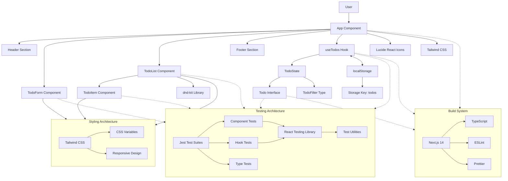
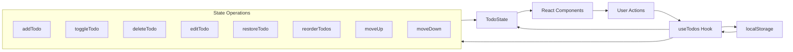

# Todo App Architecture Flow

This document provides a comprehensive overview of the Todo App's architecture, component hierarchy, data flow, and
integration patterns.

## Architecture Overview

The Todo App follows a modern React architecture pattern with custom hooks for state management, localStorage for
persistence, and a comprehensive testing strategy.

## Core Architecture Flow



## Component Hierarchy

### Primary Components

1. **App Component** (`page.tsx`)
   - Root component managing the overall layout
   - Integrates all child components
   - Manages the main application state via `useTodos` hook

2. **TodoForm Component** (`components/TodoForm.tsx`)
   - Handles new todo creation
   - Auto-resizing textarea with multi-line support
   - Form validation and submission
   - Keyboard shortcuts (Enter to submit, Shift+Enter for new lines)

3. **TodoList Component** (`components/TodoList.tsx`)
   - Renders list of todos with sorting and filtering
   - Drag-and-drop reordering functionality
   - Manages todo operations (toggle, delete, edit, restore)
   - Responsive layout with accessibility features

4. **TodoItem Component** (`components/TodoItem.tsx`)
   - Individual todo item management
   - Inline editing with textarea support
   - Multi-line text display with line break preservation
   - Action buttons (edit, delete, restore, reorder)
   - Prevents accidental unchecking of completed todos

## Data Flow Architecture

### State Management Pattern



### Data Persistence

- **Storage Key**: `'todos'`
- **Format**: JSON serialized Todo array
- **Sync Strategy**: Real-time synchronization on every state change
- **Error Handling**: Graceful fallback for corrupted data
- **Browser Compatibility**: Works across all modern browsers

## Key Architectural Patterns

### 1. Custom Hook Pattern

- `useTodos` encapsulates all todo-related state and operations
- Provides clean API to components
- Handles localStorage synchronization
- Manages complex state transitions

### 2. Unidirectional Data Flow

- Data flows down from parent to child components
- Events bubble up through callback props
- State updates trigger re-renders automatically
- Predictable data flow for debugging

### 3. Component Composition

- Small, focused components with single responsibilities
- Props-based configuration for flexibility
- Reusable UI patterns across the application
- Clear separation of concerns

### 4. Type Safety

- TypeScript interfaces for all data structures
- Strict type checking throughout the application
- Compile-time error prevention
- Enhanced developer experience

## Testing Architecture

### Test Structure

```text
app/
├── __tests__/
│   ├── components/
│   │   ├── TodoForm.test.tsx
│   │   ├── TodoList.test.tsx
│   │   ├── TodoItem.test.tsx
│   │   └── ...
│   ├── hooks/
│   │   └── useTodos.test.ts
│   └── types/
│       └── todo.test.ts
```

### Testing Strategy

- **Unit Tests**: Individual components and hooks
- **Integration Tests**: Component interactions
- **End-to-End**: User workflow testing
- **Type Tests**: TypeScript interface validation

### Testing Tools

- **Jest**: Test runner and assertion library
- **React Testing Library**: Component testing utilities
- **@testing-library/user-event**: User interaction simulation
- **Custom Test Utils**: Shared testing helpers

## External Dependencies

### Core Dependencies

- **React 18**: UI framework with modern features
- **Next.js 14**: Full-stack React framework with App Router
- **TypeScript**: Static type checking
- **@dnd-kit**: Drag and drop functionality

### UI Dependencies

- **Tailwind CSS**: Utility-first CSS framework
- **Lucide React**: Icon library
- **CSS Variables**: Theme system support

### Development Dependencies

- **ESLint**: Code linting and quality checks
- **Prettier**: Code formatting
- **Jest**: Testing framework
- **React Testing Library**: Component testing

## Performance Considerations

### Optimization Strategies

- **Component Memoization**: Prevent unnecessary re-renders
- **Efficient State Updates**: Batched updates for better performance
- **localStorage Debouncing**: Prevent excessive storage writes
- **Lazy Loading**: Code splitting for faster initial loads

### Accessibility Features

- **ARIA Labels**: Screen reader support
- **Keyboard Navigation**: Full keyboard accessibility
- **Focus Management**: Proper focus handling
- **Color Contrast**: WCAG compliant color schemes

## Future Architecture Considerations

### Scalability

- **State Management**: Consider Redux/Zustand for complex state
- **API Integration**: RESTful or GraphQL API support
- **Real-time Updates**: WebSocket integration
- **Offline Support**: Service Worker implementation

### Performance

- **Virtual Scrolling**: For large todo lists
- **Background Sync**: Offline-to-online synchronization
- **Caching Strategy**: Optimistic updates and cache management
- **Bundle Optimization**: Tree shaking and code splitting

---

This architecture documentation provides a comprehensive overview of the Todo App's structure, patterns, and design
decisions. It serves as a reference for developers working on the project and documents the current implementation
accurately.
