# Development Workflow Diagram

This document visualizes the complete development workflow used in the Todo App project, including GitHub Issues
management, TDD methodology, ADR creation, code quality gates, and feature development lifecycle.

## Complete Development Workflow

## TDD Cycle Detail

The Test-Driven Development cycle is the core of our development process:

## ADR Creation Process

Architecture decisions follow this workflow before implementation:

## Code Quality Gates

Multiple quality checks ensure code meets standards before merge:

```mermaid
graph TB
    Code[Code Ready] --> PreCommit[Pre-commit Hook]

    PreCommit --> Prettier[Prettier Format Check]
    Prettier --> ESLint[ESLint Validation]
    ESLint --> TypeScript[TypeScript Type Check]
    TypeScript --> Complexity[Complexity Analysis]

    Complexity --> CognitiveCheck{Cognitive<br/>≤15?}
    Complexity --> NestingCheck{Nesting<br/>≤4?}
    Complexity --> CyclomaticCheck{Cyclomatic<br/>≤15?}

    CognitiveCheck -->|No| Fail
    NestingCheck -->|No| Fail
    CyclomaticCheck -->|No| Fail

    CognitiveCheck -->|Yes| Pass
    NestingCheck -->|Yes| Pass
    CyclomaticCheck -->|Yes| Pass

    Pass[All Checks Pass] --> AllowCommit[Commit Allowed]
    Fail[Checks Fail] --> BlockCommit[Commit Blocked]
    BlockCommit --> FixIssues[Fix Issues]
    FixIssues --> PreCommit

    AllowCommit --> CI[CI Pipeline]
    CI --> BuildCheck[Build Verification]
    CI --> TestSuite[Test Suite Execution]
    CI --> LintCI[ESLint on CI]
    CI --> TypeCheckCI[TypeScript on CI]

    BuildCheck --> CIPassed{All CI<br/>Checks<br/>Pass?}
    TestSuite --> CIPassed
    LintCI --> CIPassed
    TypeCheckCI --> CIPassed

    CIPassed -->|Yes| ReadyMerge[Ready for Merge]
    CIPassed -->|No| FixCI[Fix CI Failures]
    FixCI --> Code

    style Pass fill:#e1ffe1
    style AllowCommit fill:#e1ffe1
    style ReadyMerge fill:#e1ffe1
    style Fail fill:#ffe1e1
    style BlockCommit fill:#ffe1e1
    style FixIssues fill:#ffe1e1
    style FixCI fill:#ffe1e1
```

## GitHub Projects Integration

Issues move through statuses automatically via workflow automation:

## Claude Code Integration Points

Claude Code agents integrate at key workflow stages:

```mermaid
graph TB
    Human[Human: Requirements & Strategy] --> Claude[Claude Code Agent]

    Claude --> Planning[Task Planning with TodoWrite]
    Claude --> ADRCreate[ADR Documentation]
    Claude --> TDD[TDD Implementation]
    Claude --> Quality[Quality Assurance]
    Claude --> Docs[Documentation Updates]

    Planning --> Frontend[frontend-specialist Agent]
    Planning --> Testing[testing-specialist Agent]
    Planning --> QA[quality-assurance Agent]
    Planning --> DocAgent[documentation-agent Agent]

    Frontend --> Code[TypeScript/React Code]
    Testing --> Tests[Comprehensive Tests]
    QA --> Review[Code Review & Standards]
    DocAgent --> Documentation[README/ADR Updates]

    Code --> Integration[Integration & PR]
    Tests --> Integration
    Review --> Integration
    Documentation --> Integration

    Integration --> Attribution[🤖 AI Agent Attribution]
    Attribution --> Commit[Atomic Commits]
    Commit --> PR[Pull Request]

    style Human fill:#e1f5e1
    style Claude fill:#cfe2ff
    style Frontend fill:#ffe1f0
    style Testing fill:#ffe1f0
    style QA fill:#ffe1f0
    style DocAgent fill:#ffe1f0
    style Attribution fill:#fff3cd
```

## Feature Development Lifecycle Summary

```mermaid
graph LR
    Idea[💡 Idea] --> Issue[📋 Issue]
    Issue --> Plan[📝 Plan]
    Plan --> ADR{ADR<br/>Needed?}
    ADR -->|Yes| Doc[📄 Document]
    ADR -->|No| Dev[💻 Develop]
    Doc --> Dev
    Dev --> Test[🧪 Test]
    Test --> Review[👀 Review]
    Review --> Merge[🔀 Merge]
    Merge --> Ship[🚀 Ship]

    style Idea fill:#fff3cd
    style Issue fill:#cfe2ff
    style Plan fill:#e1e1ff
    style Doc fill:#ffe1f0
    style Dev fill:#e1ffe1
    style Test fill:#e1ffe1
    style Review fill:#ffd4e1
    style Merge fill:#d1e7dd
    style Ship fill:#e1f5e1
```

## Workflow Phases

### Phase 1: Planning

- Create GitHub issue with priority/complexity labels
- Add to GitHub Projects
- Execute `/work-on` command to start workflow
- Create ADR if architectural decision needed
- Use TodoWrite for complex changes requiring task breakdown

### Phase 2: Development

- Create feature branch (`feature/XX-description`)
- Follow TDD cycle: Red → Green → Refactor
- Make atomic commits with conventional format
- Include AI attribution in all commits
- Update documentation as needed

### Phase 3: Quality Assurance

- Pre-commit hooks validate code quality
- ESLint ensures zero errors/warnings
- TypeScript strict mode compliance
- Complexity standards (ADR-027) enforcement
- Test coverage minimum 80%

### Phase 4: Integration

- Push feature branch to remote
- Create pull request with "Closes #XX"
- Enable automerge with `--rebase` strategy
- CI pipeline validates all checks
- Required reviewer approval

### Phase 5: Completion

- PR auto-merges when requirements met
- Issue automatically closed via PR
- GitHub Projects status updates to "Done"
- Feature branch automatically deleted
- Verify completion with `gh issue view #XX`

## Key Principles

> **Strategic Context**: See [Development Principles](../core/principles.md) for the philosophy and strategic
> importance of these principles.

### Atomic Commits

- Each commit addresses a single concern
- Follow conventional commit format
- Include issue number in commit message
- Multiple commits per feature for clear history

### AI Attribution

- All commits include `🤖 Generated with AI Agent`
- Co-authored by human collaborator
- Maintains transparency and credit
- Required per ADR-015

### Quality First

- Tests written before implementation
- Zero tolerance for ESLint warnings
- Strict TypeScript with no `any` types
- Complexity limits strictly enforced

### Automated Workflow

- Pre-commit hooks catch issues early
- CI pipeline validates comprehensively
- Auto-merge reduces manual intervention
- GitHub Projects tracks status automatically

---

This workflow ensures consistent, high-quality development while maintaining the instruction-only methodology and
leveraging Claude Code's specialized agents for optimal results.
