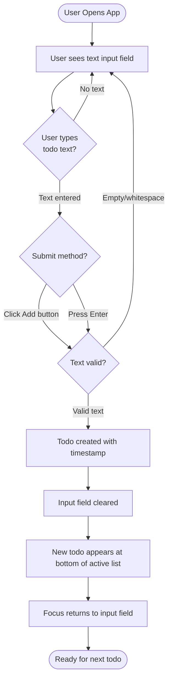
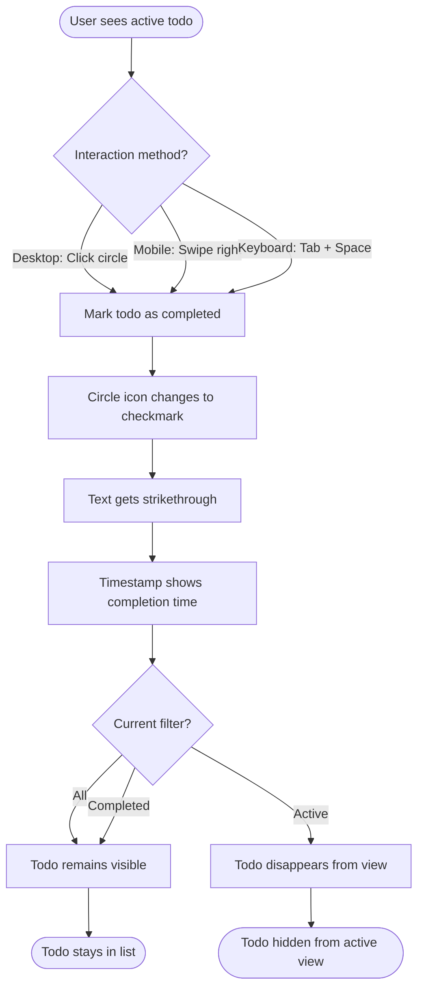
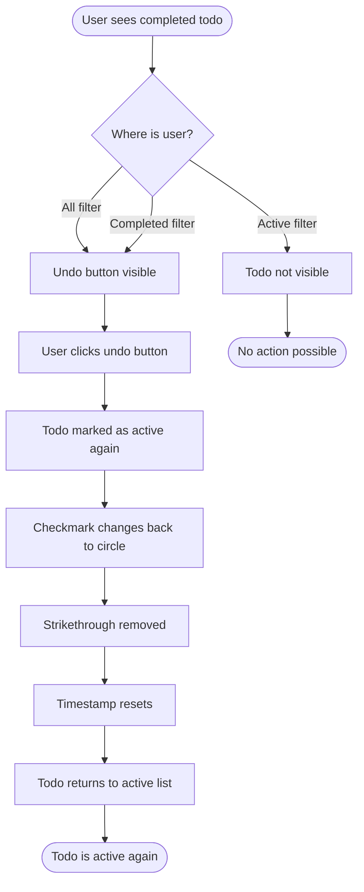
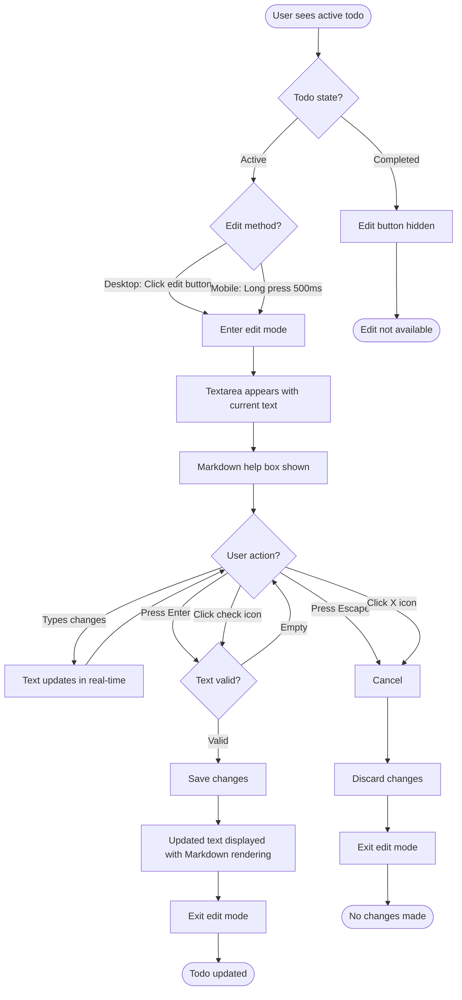
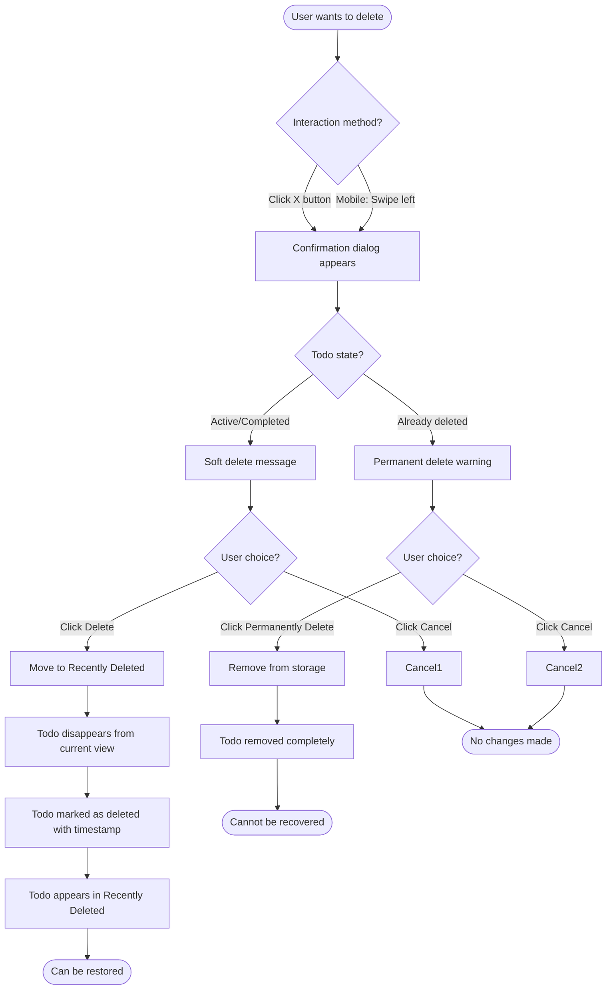
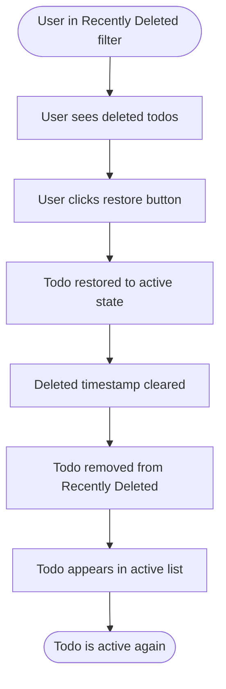
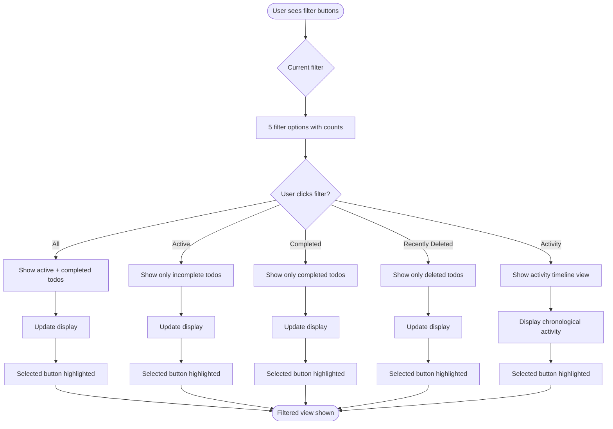
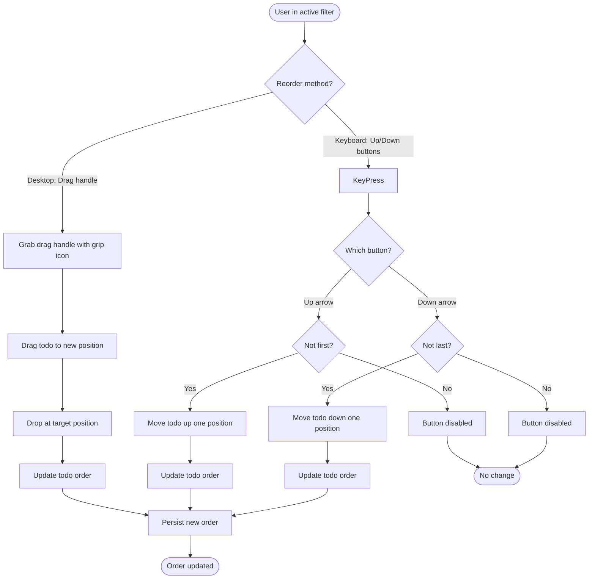
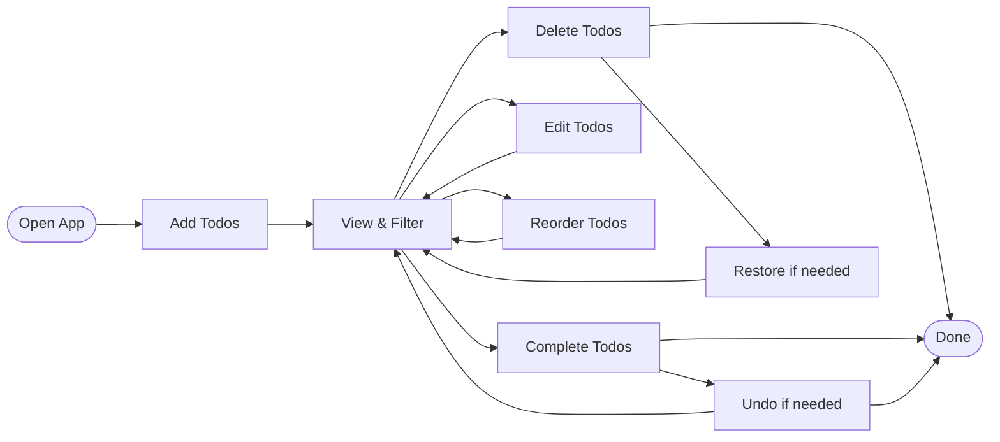
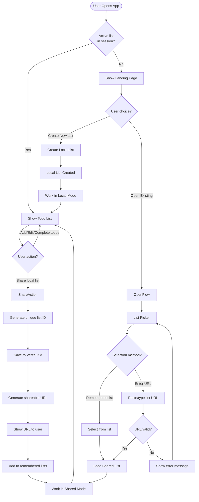

# User Flow Diagrams

This document illustrates the main user interaction flows for the Todo App using Mermaid diagrams.

## Add New Todo Flow

**User Actions:**

- Type todo text in input field (supports Markdown syntax)
- Submit via Enter key or clicking "Add" button
- Input automatically clears after successful submission

**System Behavior:**

- Only non-empty text creates todos
- New todos appear in active list
- Focus returns to input for continuous adding
- Auto-resize textarea based on content

## Toggle Todo Status Flow

**User Actions:**

- Click/tap the circle icon (desktop/mobile)
- Swipe right gesture (mobile only)
- Keyboard: Tab to circle, press Space/Enter

**System Behavior:**

- Icon changes from circle to checkmark
- Text gets strikethrough styling
- Timestamp updates to show completion time
- Todo moves to completed filter
- Cannot be unchecked via circle (use undo instead)

## Undo Completion Flow

**User Actions:**

- Click the undo button (curved arrow icon) on completed todo
- Available in "All" and "Completed" filters

**System Behavior:**

- Todo returns to active state
- Checkmark reverts to circle
- Strikethrough styling removed
- Todo reappears in active list

## Edit Todo Flow

**User Actions:**

- Click edit button (pencil icon) - desktop
- Long press on todo (500ms) - mobile
- Edit text in textarea
- Save with Enter, check icon, or Cancel with Escape, X icon

**System Behavior:**

- Edit mode only available for active todos
- Markdown help displayed during editing
- Auto-resize textarea based on content
- Markdown rendered after saving
- Changes discarded on cancel

## Delete Todo Flow

**User Actions:**

- Click X button on todo
- Swipe left gesture (mobile)
- Confirm or cancel in dialog

**System Behavior:**

- First delete: Soft delete to Recently Deleted
- Second delete: Permanent removal with warning
- Confirmation dialog prevents accidental deletion
- Soft-deleted todos can be restored

## Restore Deleted Todo Flow

**User Actions:**

- Navigate to "Recently Deleted" filter
- Click restore button (curved arrow) on deleted todo

**System Behavior:**

- Todo returns to active state
- Deleted timestamp removed
- Todo moves back to active list
- Appears in original position

## Filter Todos Flow

**User Actions:**

- Click any of the 5 filter buttons
- Buttons show current count for each category

**Filter Options:**

1. **All**: Active and completed todos (excludes deleted)
2. **Active**: Only incomplete todos
3. **Completed**: Only completed todos
4. **Recently Deleted**: Only soft-deleted todos
5. **Activity**: Chronological timeline of all changes

**System Behavior:**

- Active filter button visually highlighted
- List updates immediately
- Counts update in real-time
- Activity filter shows different view (timeline vs. list)

## Reorder Todos Flow

**User Actions:**

- Drag and drop using grip handle (desktop)
- Click up/down chevron buttons
- Only available in active filter

**System Behavior:**

- Drag handle visible in active filter
- Up button disabled for first item
- Down button disabled for last item
- Order persisted to localStorage
- Visual feedback during drag operation

## Overall User Journey

## List Lifecycle Flow

This diagram shows how users create, share, and access lists (see [ADR-031](../adr/031-list-lifecycle-architecture.md)).

**Entry Points:**

1. **Create New List** → Local ephemeral list (in-memory only)
2. **Open Existing** → Remembered lists or manual URL entry

**List Types:**

| Type   | Storage   | Persistence  | Collaboration   |
| ------ | --------- | ------------ | --------------- |
| Local  | In-memory | Session only | Single user     |
| Shared | Vercel KV | Permanent    | Anyone with URL |

**Sharing Flow:**

1. User works on local list
2. Clicks "Share" action
3. System generates unique list ID
4. Todos saved to Vercel KV
5. User receives shareable URL
6. List added to remembered lists
7. Real-time sync enabled

**Remembered Lists:**

- Stored in localStorage
- Shown in "Open Existing" picker
- Tracks listId, name, lastAccessed, isOwner
